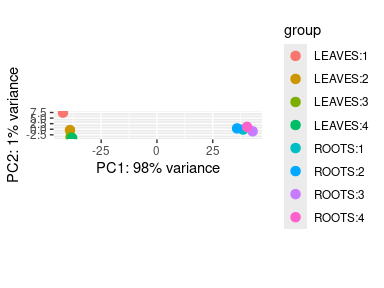
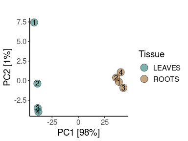
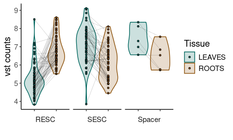
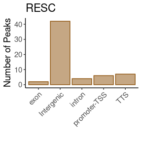
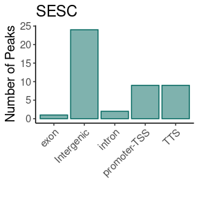
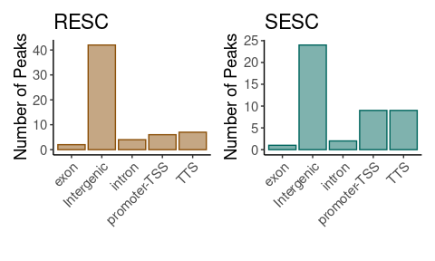

ATAC-seq analysis
================

Download datasets

``` r
library(tidyverse)
library(patchwork)
```

# Peak analysis

## Load count table

``` r
count_files <- list.files(path = "input", 
                    pattern = ".counts", 
                    full.names = T) %>% 
  as_tibble() %>%
  mutate(path = value) %>%
  separate(col = value, sep = "/", into = c('c1', 'file_name')) %>%
  select(path, file_name) %>%
  separate(col = file_name, sep = "\\.", into = c('sample')) %>%
  mutate(count = 'c') %>%
  unite('sample', sample:count, sep = '_')
```

``` r
for (file in 1:nrow(count_files)) {
  assign(count_files$sample[file], 
         read_table(count_files$path[file],
                    col_names = c('chr', 'start', 'end', 'peak_id', 'score', 'strand', 'misc1', 'misc2', 'misc3', 'misc4', 'counts')
                    ) %>% mutate(sample = count_files$sample[file]) %>%
           select(c('chr', 'start', 'end', 'peak_id', 'counts', 'sample')
         ) ) # The result of the function call read_delim is assigned to the name using the assign() function
 
}


# create a dataframe with the read length of all the samples
peak_counts <- bind_rows(mget(ls(pattern = "_c$")))

# remove from the global environment the single files
# the $ indicates nothing after 

remove(list = ls(pattern = "_c$"))
```

``` r
peak_counts_dss <- peak_counts %>% 
  mutate(sample = gsub('_c', '', sample) ) %>%
  pivot_wider(names_from = sample,
              values_from = counts ) %>%
  unite(peak_id, peak_id, chr, start, end) %>%
  column_to_rownames('peak_id') %>%
  as.matrix()
```

Metadata

``` r
peak_counts_metadata <- data.frame(SampleName = colnames(peak_counts_dss)
                                 )  %>%
  separate(SampleName, c("Tissue", "Replicate"), remove = F) %>%
  column_to_rownames("SampleName") %>%
  mutate(Replicate = gsub('REP', '', Replicate))
```

``` r
all(rownames(peak_counts_metadata) %in% colnames(peak_counts_dss))
```

    ## [1] TRUE

``` r
dds_peak_counts <- DESeq2::DESeqDataSetFromMatrix(countData = peak_counts_dss,
                                   colData = peak_counts_metadata,
                                   design = ~ Tissue)
dds_peak_counts
```

    ## class: DESeqDataSet 
    ## dim: 89396 8 
    ## metadata(1): version
    ## assays(1): counts
    ## rownames(89396): peak_1_chr1_24890_25230 peak_1_chr1_25410_26640 ...
    ##   peak_78675_tig00447267_6690_6830 peak_78676_tig00447267_19710_20120
    ## rowData names(0):
    ## colnames(8): LEAVES_REP1 LEAVES_REP2 ... ROOTS_REP3 ROOTS_REP4
    ## colData names(2): Tissue Replicate

Normalise

``` r
vst_peak_counts <- DESeq2::vst(dds_peak_counts)
```

## Supplementary Figure 4B: PCA

``` r
DESeq2::plotPCA(vst_peak_counts, intgroup = c("Tissue", "Replicate"), ntop = 500) 
```

<!-- -->

``` r
DESeq2::plotPCA(vst_peak_counts, intgroup = c("Tissue", "Replicate"), returnData = T,ntop = 500)  %>%
  ggplot(aes(x = PC1, y=PC2, fill = Tissue, label = as.factor(Replicate))) +
  geom_point(size = 5, pch = 21, alpha = 0.5) +
  geom_text() +
  scale_fill_manual(values = c("#01665e", "#8c510a")) +
  #scale_fill_manual(values = timepoint_colors, name = "Timepoint") +
  theme_classic() +
  theme(text=element_text(family = "Helvetica", size =14)) +
  labs(title = "",
       x = "PC1 [98%]",
       y = "PC2 [1%]",
       fill = "Tissue")
```

<!-- -->

## Figure 2A: Normalised read counts on the consensus narrow peaks within each subcluster

``` r
peak_normalised <- as.matrix(vst_peak_counts@assays@data@listData[[1]]) %>% as_tibble(rownames = 'Geneid' )
```

``` r
peak_normalised_tidy <- peak_normalised %>% 
  separate(Geneid, into = c('Peak', 'Peak_number', 'Chr', 'Start', 'End'), remove = FALSE) %>%
  unite(peak_id, Peak:Peak_number) %>%
  filter(Chr == 'chr1') %>%
  pivot_longer(cols = !c('Geneid', 'Chr', 'Start', 'End', 'peak_id'),
               names_to = 'sample',
               values_to = 'vst_counts') %>%
  separate(sample, c("Tissue", "Replicate"), remove = T) %>%
  filter(Start %in% 114700000:115200000) %>% 
  group_by(Geneid, Chr, Start, End, Tissue) %>%
  summarise(mean_vst = mean(vst_counts) ) %>%
  ungroup() %>%
  mutate(subcluster = case_when(
    Start < 114967177 ~ 'RESC',
    Start > 115014655 ~ 'SESC',
    TRUE ~ 'Spacer') )
```

#### Plot

``` r
peak_normalised_tidy %>%
  ggplot(aes(
    x = Tissue,
    y = mean_vst,
    fill = Tissue)) +
  facet_grid(~factor(subcluster, levels = c("RESC", "SESC", "Spacer")), 
             drop = T,
             scales="free_x", 
             space="free_x",
             switch = "x") +
  geom_violin(alpha = 0.2,
              aes(color = Tissue) ) +
  geom_point(shape = 21,
             size = 1) + 
  geom_line(aes(group = Geneid),
            color = 'black',
            linewidth = 0.05) +
  scale_fill_manual(values = c("#01665e", "#8c510a") ) +
  scale_color_manual(values = c("#01665e", "#8c510a") ) +
  theme_classic() +
  theme(
        text = element_text(family = "Helvetica", size = 14),
        strip.placement = "outside",
        strip.background = element_blank(),
        axis.text.x = element_blank()
        ) +
  xlab('') +
  ylab('vst counts')
```

<!-- -->

## Figure 2C: peaks annotation

``` r
# ROOT 
peaks_ann_root_rs <- read_tsv('input/root_all_accessible_regions.filtered.narrowPeak.annotation', 
           skip = 1,
           col_names = c('Peak_ID', 'Chr',  'Start', 'End', 'Strand', 'Peak_Score', 'Focus_Ratio', 'Annotation') ) %>%
  filter(Chr == 'chr1') %>%
  filter(Start %in% 114700000:114967177)
```

``` r
peaks_ann_root_rs_plot <- 
  peaks_ann_root_rs %>%
  mutate(Annotation = gsub(" .*", "", Annotation)) %>%
  ggplot( aes(x = Annotation)) +
  geom_bar(color = '#8c510a',
               fill = '#8c510a',
           alpha = 0.5) + 
  theme_classic() +
  theme(
        text = element_text(family = "Helvetica", size = 14),
        axis.text.x = element_text(angle = 45, vjust = 1, hjust=1)
        ) +
  ggtitle('RESC') + 
  xlab('') +
  ylab('Number of Peaks')

peaks_ann_root_rs_plot  
```

<!-- -->

``` r
# SHOOT 
peaks_ann_leaf_rs <- read_tsv('input/leaf_all_accessible_regions.filtered.narrowPeak.annotation', 
           skip = 1,
           col_names = c('Peak_ID', 'Chr',  'Start', 'End', 'Strand', 'Peak_Score', 'Focus_Ratio', 'Annotation') ) %>%
  filter(Chr == 'chr1') %>%
  filter(Start %in% 115014655:115200000)
```

``` r
peaks_ann_leaf_rs_plot <- 
  peaks_ann_leaf_rs %>%
  mutate(Annotation = gsub(" .*", "", Annotation)) %>%
  ggplot( aes(x = Annotation)) +
  geom_bar(color = '#01665e',
               fill = '#01665e',
           alpha = 0.5) + 
  theme_classic() +
  theme(
        text = element_text(family = "Helvetica", size = 14),
        axis.text.x = element_text(angle = 45, vjust = 1, hjust=1)
        ) +
  ggtitle('SESC') + 
  xlab('') +
  ylab('Number of Peaks')

peaks_ann_leaf_rs_plot
```

<!-- -->

``` r
peaks_ann_root_rs_plot | peaks_ann_leaf_rs_plot
```

<!-- -->
