HiC analysis
================

Download datasets

``` bash
wget --no-verbose -O hic_input.tar.gz https://zenodo.org/records/13908795/files/hic_input.tar.gz?download=1
tar -xzf hic_input.tar.gz
rm -r hic_input.tar.gz

mkdir annotation
wget --no-verbose -O annotation/Phygri1.3.2_gene_models.gff.gz https://labshare.cshl.edu/shares/schatzlab/www-data/pansol/Physalis/grisea/v1.3.2/Phygri1.3.2_gene_models.gff.gz
gunzip annotation/Phygri1.3.2_gene_models.gff.gz
```

    ## 2024-10-09 15:51:12 URL:https://zenodo.org/records/13908795/files/hic_input.tar.gz?download=1 [747628811/747628811] -> "hic_input.tar.gz" [1]
    ## tar: Ignoring unknown extended header keyword 'LIBARCHIVE.xattr.com.apple.FinderInfo'
    ## 2024-10-09 15:51:23 URL:https://labshare.cshl.edu/shares/schatzlab/www-data/pansol/Physalis/grisea/v1.3.2/Phygri1.3.2_gene_models.gff.gz [7580565/7580565] -> "annotation/Phygri1.3.2_gene_models.gff.gz" [1]

``` r
library(tidyverse)
library(broom)
library(strawr)
library(patchwork)
library(pheatmap)
```

# Replicates QC: Supplementary Figure 7A

## Load normalised observed matrices

#### Leaf replicate 1

``` r
ob_chr_matrices_LR1 <- data_frame(object = c('LR1_chr1_o', 'LR1_chr2_o', 'LR1_chr3_o', 'LR1_chr4_o', 'LR1_chr5_o', 'LR1_chr6_o', 'LR1_chr7_o', 'LR1_chr8_o', 'LR1_chr9_o', 'LR1_chr10_o', 'LR1_chr11_o', 'LR1_chr12_o'),
           chr = c('01', '02', '03', '04', '05', '06', '07', '08', '09', '10', '11', '12'))

for (file in 1:nrow(ob_chr_matrices_LR1)) 
  {
  assign(as.character(ob_chr_matrices_LR1[file,1]), 
       straw(norm = "KR",
      fname = "hic_input/individual_replicates/leaf_R1_41M.hic",
      chr1loc = as.character(ob_chr_matrices_LR1[file,2]),
      chr2loc = as.character(ob_chr_matrices_LR1[file,2]),
      unit = "BP",
      binsize = 50000,
      matrix = "observed") %>% mutate(chr = as.character(ob_chr_matrices_LR1[file,2])
      )  )
}

LR1 <-  rbind(LR1_chr1_o, LR1_chr2_o, LR1_chr3_o, LR1_chr4_o, LR1_chr5_o, LR1_chr6_o, LR1_chr7_o, LR1_chr8_o, LR1_chr9_o, LR1_chr10_o, LR1_chr11_o, LR1_chr12_o) %>% mutate(sample = 'LR1')
```

#### Leaf replicate 2

``` r
ob_chr_matrices_LR2 <- data_frame(object = c('LR2_chr1_o', 'LR2_chr2_o', 'LR2_chr3_o', 'LR2_chr4_o', 'LR2_chr5_o', 'LR2_chr6_o', 'LR2_chr7_o', 'LR2_chr8_o', 'LR2_chr9_o', 'LR2_chr10_o', 'LR2_chr11_o', 'LR2_chr12_o'),
           chr = c('01', '02', '03', '04', '05', '06', '07', '08', '09', '10', '11', '12'))

for (file in 1:nrow(ob_chr_matrices_LR2)) 
  {
  assign(as.character(ob_chr_matrices_LR2[file,1]), 
       straw(norm = "KR",
      fname = "hic_input/individual_replicates/leaf_R2_41M.hic",
      chr1loc = as.character(ob_chr_matrices_LR2[file,2]),
      chr2loc = as.character(ob_chr_matrices_LR2[file,2]),
      unit = "BP",
      binsize = 50000,
      matrix = "observed") %>% mutate(chr = as.character(ob_chr_matrices_LR2[file,2])
      )  )
}

LR2 <-  rbind(LR2_chr1_o, LR2_chr2_o, LR2_chr3_o, LR2_chr4_o, LR2_chr5_o, LR2_chr6_o, LR2_chr7_o, LR2_chr8_o, LR2_chr9_o, LR2_chr10_o, LR2_chr11_o, LR2_chr12_o) %>% mutate(sample = 'LR2')
```

#### Root replicate 1

``` r
ob_chr_matrices_RR1 <- data_frame(object = c('RR1_chr1_o', 'RR1_chr2_o', 'RR1_chr3_o', 'RR1_chr4_o', 'RR1_chr5_o', 'RR1_chr6_o', 'RR1_chr7_o', 'RR1_chr8_o', 'RR1_chr9_o', 'RR1_chr10_o', 'RR1_chr11_o', 'RR1_chr12_o'),
           chr = c('01', '02', '03', '04', '05', '06', '07', '08', '09', '10', '11', '12'))

for (file in 1:nrow(ob_chr_matrices_RR1)) 
  {
  assign(as.character(ob_chr_matrices_RR1[file,1]), 
       straw(norm = "KR",
      fname = "hic_input/individual_replicates/root_R1_41M.hic",
      chr1loc = as.character(ob_chr_matrices_RR1[file,2]),
      chr2loc = as.character(ob_chr_matrices_RR1[file,2]),
      unit = "BP",
      binsize = 50000,
      matrix = "observed") %>% mutate(chr = as.character(ob_chr_matrices_RR1[file,2])
      )  )
}

RR1 <-  rbind(RR1_chr1_o, RR1_chr2_o, RR1_chr3_o, RR1_chr4_o, RR1_chr5_o, RR1_chr6_o, RR1_chr7_o, RR1_chr8_o, RR1_chr9_o, RR1_chr10_o, RR1_chr11_o, RR1_chr12_o) %>% mutate(sample = 'RR1')
```

#### Root replicate 2

``` r
ob_chr_matrices_RR2 <- data_frame(object = c('RR2_chr1_o', 'RR2_chr2_o', 'RR2_chr3_o', 'RR2_chr4_o', 'RR2_chr5_o', 'RR2_chr6_o', 'RR2_chr7_o', 'RR2_chr8_o', 'RR2_chr9_o', 'RR2_chr10_o', 'RR2_chr11_o', 'RR2_chr12_o'),
           chr = c('01', '02', '03', '04', '05', '06', '07', '08', '09', '10', '11', '12'))

for (file in 1:nrow(ob_chr_matrices_RR2)) 
  {
  assign(as.character(ob_chr_matrices_RR2[file,1]), 
       straw(norm = "KR",
      fname = "hic_input/individual_replicates/root_R2_41M.hic",
      chr1loc = as.character(ob_chr_matrices_RR2[file,2]),
      chr2loc = as.character(ob_chr_matrices_RR2[file,2]),
      unit = "BP",
      binsize = 50000,
      matrix = "observed") %>% mutate(chr = as.character(ob_chr_matrices_RR2[file,2])
      )  )
}

RR2 <-  rbind(RR2_chr1_o, RR2_chr2_o, RR2_chr3_o, RR2_chr4_o, RR2_chr5_o, RR2_chr6_o, RR2_chr7_o, RR2_chr8_o, RR2_chr9_o, RR2_chr10_o, RR2_chr11_o, RR2_chr12_o) %>% mutate(sample = 'RR2')
```

``` r
remove(list = ls(pattern = "_o"))
remove(list = ls(pattern = "ob_"))
```

``` r
clustering_cor <- rbind(LR1, LR2, RR1, RR2) %>% 
  unite('genomic_region', c('x', 'y', 'chr'), sep = "_") %>%
  pivot_wider(values_from = counts,
              names_from = sample) %>% 
  mutate_all(~ replace(., is.na(.), 0)) %>%
  column_to_rownames('genomic_region') %>% 
  as.matrix() %>% stats::cor(method = 'pearson')
```

## Plot

``` r
clustering_cor_plot <- 
  pheatmap(clustering_cor,
         border_color = "black",
         color = rev(hcl.colors(6
                                , "Reds")),
         display_numbers = round(clustering_cor, 4),
         number_color = "black", 
         fontsize_number = 10, 
         breaks = seq(from = 0.98, to = 0.99, by = 0.002
                      ) )
clustering_cor_plot
```

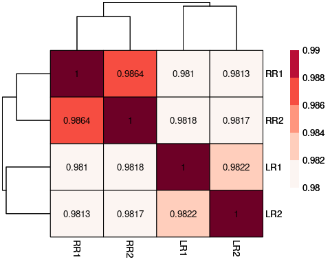<!-- -->

``` r
 ggsave(
        plot = clustering_cor_plot$gtable,
        'figures/cor_heatmap.pdf', 
        height = 4,
        width = 5,
        bg = 'white')
```

# Global A/B Compartments Supplementary Fig7B

From here on, working with the merged replicates (103 mio valid pairs)

### Load Chromosomes Observed / Expected (OE) matrices

Resolution 500-kb

``` r
oe_chr_matrices <- data_frame(object = c('shoot_chr1_oe', 'shoot_chr2_oe', 'shoot_chr3_oe', 'shoot_chr4_oe', 'shoot_chr5_oe', 'shoot_chr6_oe', 'shoot_chr7_oe', 'shoot_chr8_oe', 'shoot_chr9_oe', 'shoot_chr10_oe', 'shoot_chr11_oe', 'shoot_chr12_oe'),
           chr = c('01', '02', '03', '04', '05', '06', '07', '08', '09', '10', '11', '12'))

for (file in 1:nrow(oe_chr_matrices)) 
  {
  assign(as.character(oe_chr_matrices[file,1]), 
       straw(norm = "KR",
      fname = "hic_input/merged_replicates/leaf_103M.hic",
      chr1loc = as.character(oe_chr_matrices[file,2]),
      chr2loc = as.character(oe_chr_matrices[file,2]),
      unit = "BP",
      binsize = 500000,
      matrix = "oe")
      )
}
```

### PCA

##### Define PCA function

``` r
calculate_pca <- function(data_frame, chr) {
  result <- data_frame %>%
    rbind(data_frame(x = .$y, 
                     y = .$x, 
                     counts = .$counts)) %>%
    mutate(counts = as.numeric(counts)) %>%
    unique() %>%
    pivot_wider(names_from = y, 
                values_from = counts) %>%
    dplyr::select(!x) %>%
    filter(rowSums(is.na(.)) < ncol(.)) %>%
    keep(~!all(is.na(.x))) %>%
    mutate_all(~ replace(., is.na(.), 0)) %>%
    cor(method = "pearson") %>%
    prcomp() %>% 
    tidy('v') %>%
    filter(PC == 1) %>% 
    mutate(column = as.numeric(column)) %>%
    mutate(sign = case_when(
      value <= 0  ~ paste0("negative"),
      value > 0 ~ paste0("positive") )
    ) %>% 
    mutate(chr = chr)
  
  return(result)
}
```

##### Define names of each pca

``` r
chr_pca_plots <- data_frame(name = c('shoot_chr1_pca', 'shoot_chr2_pca', 'shoot_chr3_pca', 'shoot_chr4_pca', 'shoot_chr5_pca', 'shoot_chr6_pca', 'shoot_chr7_pca', 'shoot_chr8_pca', 'shoot_chr9_pca', 'shoot_chr10_pca', 'shoot_chr11_pca', 'shoot_chr12_pca'),
                            object = c('shoot_chr1_oe', 'shoot_chr2_oe', 'shoot_chr3_oe', 'shoot_chr4_oe', 'shoot_chr5_oe', 'shoot_chr6_oe', 'shoot_chr7_oe', 'shoot_chr8_oe', 'shoot_chr9_oe', 'shoot_chr10_oe', 'shoot_chr11_oe', 'shoot_chr12_oe'),
                            chr = c('chr1', 'chr2', 'chr3', 'chr4', 'chr5', 'chr6', 'chr7', 'chr8', 'chr9', 'chr10', 'chr11', 'chr12'))
```

##### Run PCAs

``` r
for (file in 1:nrow(chr_pca_plots)) 
  {
  assign(as.character(chr_pca_plots[file,1]),
         calculate_pca(get(chr_pca_plots[file,2][[1]]), chr_pca_plots[file,3][[1]] ) 
  )
  }
```

``` r
pca_chr_hic <- 
  rbind(shoot_chr1_pca, shoot_chr2_pca, shoot_chr3_pca, 
      shoot_chr4_pca, shoot_chr5_pca, shoot_chr6_pca, 
      shoot_chr7_pca, shoot_chr8_pca, shoot_chr9_pca, 
      shoot_chr10_pca, shoot_chr11_pca, shoot_chr12_pca)
```

``` r
remove(list = ls(pattern = "_pca"))
remove(list = ls(pattern = "_oe"))
```

### Plot

``` r
genes <- read_delim("annotation/Phygri1.3.2_gene_models.gff",
                    skip = 1,
                        col_names = c(
                                      'chr',
                                      'annotator',
                                      'feature',
                                      'start',
                                      'end',
                                      'V5',
                                      'Orientation',
                                      'V7',
                                      'Metadata'
                                    ))
chromosomes <- c('chr1', 'chr2', 'chr3', 'chr4', 'chr5', 'chr6', 'chr7', 'chr8', 'chr9', 'chr10', 'chr11', 'chr12' )

chr_ann <- genes %>% filter(chr %in% chromosomes) %>% filter(feature == 'gene') 
```

``` r
chr_order <- c('chr1', 'chr2', 'chr3', 'chr4', 'chr5', 'chr6', 'chr7', 'chr8', 'chr9', 'chr10', 'chr11', 'chr12')

pca_chr_hic_plot <- 
  pca_chr_hic %>%
  ## change the sign to match the gene-rich regions
  mutate(value = case_when(
    chr == 'chr12' ~ value * (-1),
    TRUE ~ value
  )) %>%
  mutate(sign = case_when(
    chr == 'chr12' & sign == 'positive' ~ 'negative',
    chr == 'chr12' & sign == 'negative' ~ 'positive',
    TRUE ~ sign
  )) %>%
  
  ## 
  ggplot( ) +
    facet_grid(vars(fct_relevel(chr, chr_order)), 
             scales = "free_y", 
             #ncol = 1,
             labeller = label_parsed,
             switch = "y") +
    geom_hline(yintercept=0, color = 'gray') +
    geom_col(aes(x = column,
                 y = value,
                 fill = sign, 
                 alpha = 0.5),
             width = 500000) +
    geom_line( aes(x = column,
                   y = value)) +
    scale_fill_manual(values=c("#af8dc3", "#7fbf7b"), guide=FALSE) +
    scale_y_continuous(limits = c(-0.15, 0.15)) +
    scale_x_continuous( 
                      breaks = c(20000000, 40000000, 60000000, 80000000, 100000000), 
                      labels = c('20 Mb', '40 Mb', '60 Mb', '80 Mb', '100 Mb') )  +
  ## Adding gene density 
    geom_rect(data = chr_ann,
      aes(
        xmin = start,
        xmax = end,
        ymin = -0.12,
        ymax = -0.15), 
      fill = "black" ) +
  ## 
    theme_classic() +
    theme(
        text = element_text(family = "Helvetica", size = 14),
        axis.text.x = element_text(size = 12, angle = 45, vjust = 0.4, hjust=0.5),
        strip.text.x = element_text(face = "bold"),
        strip.background = element_rect(colour = "black", 
                                        fill = "white",
                                        linewidth = 0),
        panel.border = element_rect(fill = NA,
                                    linewidth = 1,
                                    color = "black"),
        panel.spacing = unit(0.2, "lines"),
        legend.title = element_blank(),
        legend.key.height = unit(1, 'cm'),
        strip.placement = 'right',
        legend.position = "none"
        ) +
    labs(x = "", y = "PC1 Eigenvector")
   
pca_chr_hic_plot
```

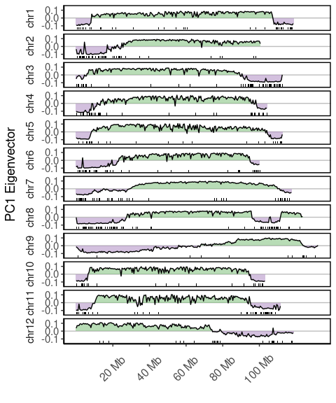<!-- -->

``` r
ggsave('figures/global_AB_annotation.pdf',
       width = 5,
       height = 8,
       bg = 'white')
```

# Withanolides cluster packing and insulation (Figure 3)

## Load data

``` r
# ROI = region of interest

leaf_roi_obs <- 
  straw(norm = "KR",
      fname = "hic_input/merged_replicates/leaf_103M.hic",
      chr1loc = "01:114000000:116000000",
      chr2loc = "01:114000000:116000000",
      unit = "BP",
      binsize = 20000,
      matrix = "observed")

root_roi_obs <- 
  straw(norm = "KR",
      fname = "hic_input/merged_replicates/root_103M.hic",
      chr1loc = "01:114000000:116000000",
      chr2loc = "01:114000000:116000000",
      unit = "BP",
      binsize = 20000,
      matrix = "observed")
```

## Plot Norm. Counts

``` r
figure_3A <-
  leaf_roi_obs %>%
  mutate(tissue = 'leaf') %>%
  # add root data below the main diagonal
  rbind(data_frame(x = root_roi_obs$y, 
                   y = root_roi_obs$x, 
                   counts = root_roi_obs$counts,
                   tissue = 'root')) %>%
  # plot 
  mutate(x = as.numeric(x)) %>%
  mutate(y = as.numeric(y)) %>%
  ggplot(
    aes(x = y,
        y = x,
        fill = counts,
        color = counts)
  ) +
    geom_tile(color = NA,
              linewidth = NA) +
    scale_fill_gradientn(
                        name = "Norm. Counts",
                        colors = RColorBrewer::brewer.pal(9, "Reds"),
                       #na.value = "#F7FCFD",
                        breaks = c(0, 50, 100),
                        limits = c(0, 100),
                        oob  = scales::oob_squish) +
  theme_classic() +
  scale_y_reverse( breaks = c(114000000, 114711578, 114965818, 115118104, 116000000), 
                   labels = c('114 Mb', '114.71 Mb', '11.96 Mb', '115.11 Mb', '116 Mb'),
                   expand = c(0, 0)
                   ) + 
  # reverse just to have same orientation than juicebox
  scale_x_continuous( breaks = c(114000000, 114711578, 114965818, 115118104, 116000000), 
                   labels = c('114 Mb', '114.71 Mb', '11.96 Mb', '115.11 Mb', '116 Mb'),
                      position = 'top',
                      expand = c(0, 0) # removes space between plot and axis
                      )  +
  theme(
        # Legend
        legend.key.size = unit(0.3, 'cm'), #change legend key size
        legend.key.height = unit(0.3, 'cm'), #change legend key height
        legend.key.width = unit(0.3, 'cm'), #change legend key width
        legend.title = element_text(size = 8), #change legend title font size
        legend.text = element_text(size = 8),

        axis.line = element_blank(),
        text = element_text(family = "Helvetica", size = 10),
        #axis.ticks = element_blank(),
        axis.text.x = element_text(angle = 45, vjust = 0, hjust=0),
        panel.grid = element_blank(),
        axis.title.x = element_blank(),
        axis.title.y = element_blank(),
        #legend.position = "none",
        plot.title = element_text(size = 10),
        panel.border = element_rect(fill = NA,
                                    linewidth = 0.2,
                                    color = "black")
        ) +
  coord_fixed() + # keep the plot squared
  # Point the clusters 
  geom_vline(xintercept = c(c(114711578, 114965818, 115118104)),
             lty = 2,
             size = 0.2,
             color = "black") +
  geom_hline(yintercept = c(c(114711578, 114965818, 115118104)),
             lty = 2,
             size = 0.2, 
             color = "black")
figure_3A
```

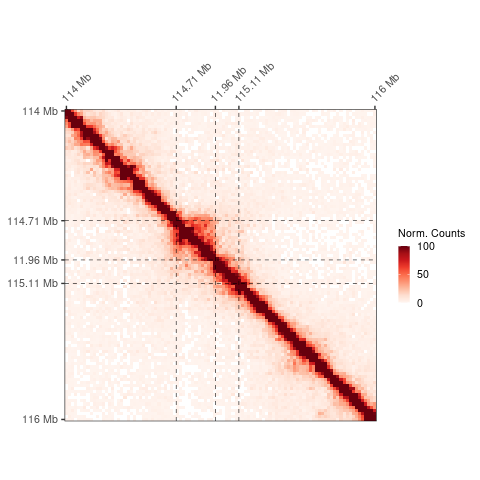<!-- -->

``` r
ggsave('figures/clusters_hic_figure_3A.pdf',
       dpi = 300,
       width = 5,
       height = 5,
       bg = 'white')
```

## Plot log(root/shoot)

To see the higher degree of packing in the root subcluster in shoot
tissue.

Juicebox calculates first the average counts of the whole normalized
Hi-C map on chromosome 1 and divides the normalized counts on each bin
by this mean. Then, it divides your observed (root) / control (leaf)
Hi-C maps.

#### Average counts chr1 20kb

``` r
leaf_chr1_20kb <- 
  straw(norm = "KR",
      fname = "hic_input/merged_replicates/leaf_103M.hic",
      chr1loc = "01",
      chr2loc = "01",
      unit = "BP",
      binsize = 20000,
      matrix = "observed")


leaf_avg_counts_chr1_20kb <- leaf_chr1_20kb$counts %>% mean(na.rm = TRUE)


root_chr1_20kb <- 
  straw(norm = "KR",
      fname = "hic_input/merged_replicates/root_103M.hic",
      chr1loc = "01",
      chr2loc = "01",
      unit = "BP",
      binsize = 20000,
      matrix = "observed")

root_avg_counts_chr1_20kb <- root_chr1_20kb$counts %>% mean(na.rm = TRUE)
```

#### Get symmetric matrices

``` r
leaf_roi_obs_symmetric <- 
  leaf_roi_obs %>%
  mutate(tissue = 'leaf') %>%
  rbind(data_frame(x = leaf_roi_obs$y, 
                   y = leaf_roi_obs$x, 
                   counts = leaf_roi_obs$counts,
                   tissue = 'leaf')) %>%
  unique() %>%
  # divide by the average counts of chr1
  mutate(counts_divided_avg = counts / leaf_avg_counts_chr1_20kb )

root_roi_obs_symmetric <- 
  root_roi_obs %>%
  mutate(tissue = 'root') %>%
  # transform the upper diagonal matrix in ROI_shoot_obs to a full symmetric matrix in long format
  rbind(data_frame(x = root_roi_obs$y, 
                   y = root_roi_obs$x, 
                   counts = root_roi_obs$counts,
                   tissue = 'root')) %>%
  unique() %>%
  # divide by the average counts of chr1
  mutate(counts_divided_avg = counts / root_avg_counts_chr1_20kb )
```

#### Plot

``` r
figure_3B <-
  rbind(leaf_roi_obs_symmetric, root_roi_obs_symmetric) %>%
  select(!counts) %>%
  group_by(x, y) %>%
  reframe(root_shoot = counts_divided_avg[tissue == "root"] / counts_divided_avg[tissue == "leaf"]) %>%
  mutate(root_shoot = log2(root_shoot)) %>%
  ungroup() %>%
  ggplot(
    aes(x = y,
        y = x,
        fill = root_shoot)
  ) +
    geom_tile() +
    scale_fill_gradientn(
                        name = "log2(root/shoot)",
                        colors = rev(RColorBrewer::brewer.pal(11, "PuOr")),
                        na.value = "#F7FCFD",
                        limits = c(-3, 3),
                        oob  = scales::oob_squish) +
  theme_classic() +
  scale_y_reverse( breaks = c(114000000, 114711578, 114965818, 115118104, 116000000), 
                   labels = c('114 Mb', '114.71 Mb', '114.96 Mb', '115.11 Mb', '116 Mb'),
                   expand = c(0, 0)
                   ) + 
  # reverse just to have same orientation than juicebox
  scale_x_continuous( breaks = c(114000000, 114711578, 114965818, 115118104, 116000000), 
                   labels = c('114 Mb', '114.71 Mb', '114.96 Mb', '115.11 Mb', '116 Mb'),
                      position = 'top',
                      expand = c(0, 0)
                      )  +
  theme(
        legend.key.size = unit(0.3, 'cm'), 
        legend.key.height = unit(0.3, 'cm'),
        legend.key.width = unit(0.3, 'cm'), 
        legend.title = element_text(size = 8),
        legend.text = element_text(size = 8),
        axis.line = element_blank(),
        text = element_text(family = "Helvetica", size = 10),
        axis.text.x = element_text(angle = 45, vjust = 0, hjust=0),
        panel.grid = element_blank(),
        axis.title.x = element_blank(),
        axis.title.y = element_blank(),
        plot.title = element_text(size = 10),
        panel.border = element_rect(fill = NA,
                                    linewidth = 0.2,
                                    color = "black")
        ) +
  coord_fixed() +
  
  # Indicate each sub-cluster 
  geom_vline(xintercept = c(c(114711578, 114965818, 115118104)),
             lty = 2,
             size = 0.2,
             color = "black") +
  geom_hline(yintercept = c(c(114711578, 114965818, 115118104)),
             lty = 2,
             size = 0.2, 
             color = "black")

figure_3B 
```

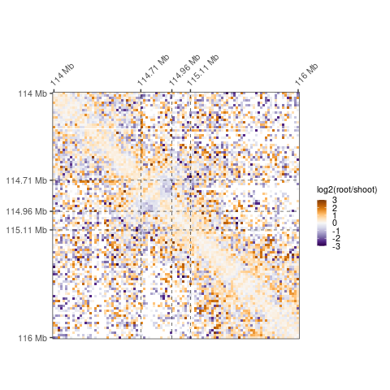<!-- -->

``` r
ggsave('figures/clusters_hic_packing.pdf',
       dpi = 300,
       width = 5,
       height = 5,
       bg = 'white')
```

# Local A/B compartment (Figures 3C,D)

PCA on the normalized contact matrix

We specifically want to look at the region 108-118Mb in chromosome 1. We
expect that the whole cluster will loop out of the neighbouring region

### Figure 3C Leaf

``` r
leaf_roi_obs_ab_compartment <- 
  straw(norm = "KR",
      fname = "hic_input/merged_replicates/leaf_103M.hic",
      chr1loc = "01:108000000:118000000",
      chr2loc = "01:108000000:118000000",
      unit = "BP",
      binsize = 20000,
      matrix = "observed")

leaf_roi_oe_ab_compartment <-  
  straw(norm = "KR",
      fname = "hic_input/merged_replicates/leaf_103M.hic",
      chr1loc = "01:108000000:118000000",
      chr2loc = "01:108000000:118000000",
      unit = "BP",
      binsize = 20000,
      matrix = "oe")
```

#### Plot the obs matrix (Supplementary Figure 7D)

``` r
leaf_roi_obs_ab_compartment %>%
  # transform the upper diagonal matrix in leaf_roi_obs_ab_compartment to a full symmetric matrix in long format
  rbind(data_frame(x = leaf_roi_obs_ab_compartment$y, 
                   y = leaf_roi_obs_ab_compartment$x, 
                   counts = leaf_roi_obs_ab_compartment$counts)) %>%
  
  # x = a and y = a will be repeated twice, that's why we do unique
  unique() %>%
  
  # plot 
  ggplot(
    aes(x = y,
        y = x,
        fill = counts)
  ) +
    geom_tile(color = NA, lwd = 0) +
    scale_fill_gradientn(name = 'Norm. Counts',
                         colors = RColorBrewer::brewer.pal(9, "Reds"),
                         limits = c(0, 10),
                         breaks = c(0, 5, 10),
                         oob  = scales::oob_squish) +
  theme_classic() +
  scale_y_reverse( breaks = c(108000000, 114711578, 115118104, 118000000), 
                   labels = c('108 Mb', '114.71 Mb', '115.11 Mb', '118 Mb'),
                   expand = c(0, 0)
                   ) + 
  
  scale_x_continuous( breaks = c(108000000, 114711578, 115118104, 118000000), 
                      labels = c('108 Mb', '114.71 Mb', '115.11 Mb', '118 Mb'),
                      position = 'top',
                      expand = c(0, 0)
                      )  +
  theme(
        legend.key.size = unit(0.3, 'cm'), 
        legend.key.height = unit(0.3, 'cm'),
        legend.key.width = unit(0.3, 'cm'), 
        legend.title = element_text(size = 8),
        legend.text = element_text(size = 8),
        axis.line = element_blank(),
        text = element_text(family = "Helvetica", size = 10),
        axis.text.x = element_text(angle = 45, vjust = 0, hjust=0),
        panel.grid = element_blank(),
        axis.title.x = element_blank(),
        axis.title.y = element_blank(),
        plot.title = element_text(size = 10),
        panel.border = element_rect(fill = NA,
                                    linewidth = 0.2,
                                    color = "black")
        ) +
  coord_fixed() +
  ggtitle('Leaf')
```

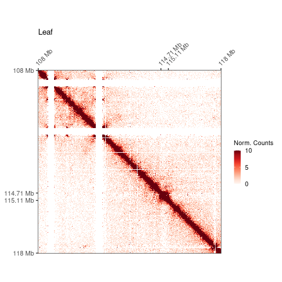<!-- -->

``` r
ggsave('figures/leaf_banded_area.pdf',
       dpi = 300,
       width = 4,
       height = 4,
       bg = 'white')
```

#### Figure 3C Plot Pearson’s correlation of the O/E matrix (Figure 3C)

``` r
cor_leaf <- 
  leaf_roi_oe_ab_compartment %>%
  rbind(data_frame(x = leaf_roi_oe_ab_compartment$y, 
                   y = leaf_roi_oe_ab_compartment$x, 
                   counts = leaf_roi_oe_ab_compartment$counts)) %>%
  unique() %>%
  
  # wide symmetric matrix necessary for pca 
  pivot_wider(names_from = y, 
              values_from = counts) %>%
  
  # remove row names 
  dplyr::select(!x) %>%
  
  # Remove columns and rows that only contain NAs. 
  
  filter(rowSums(is.na(.)) < ncol(.)) %>%
  keep(~!all(is.na(.x)))  %>%
    
  # there are some loci that do not contact in our data set (NAs). prcomp() can not handle missing values
  # we will assume that those NAs means that the contacts are 0 

  mutate_all(~ replace(., is.na(.), 0)) %>%
  
  #correlation
  cor(method = "pearson") %>%
  as_tibble() %>%
  mutate(x = colnames(.)) %>%
  pivot_longer(!x, names_to = "y", values_to = "cor") %>%
  mutate_all(as.numeric) %>%
  
  
  ggplot(
    aes(x = x,
        y = y,
        fill = cor)
  ) +
  geom_tile() +
  scale_fill_gradientn(
                        name = "",
                        colors = rev(RColorBrewer::brewer.pal(11, "RdBu")),
                        na.value = "#F7FCFD",
                        breaks = c(-0.5, 0.5),
                        limits = c(-0.5, 0.5),
                        oob  = scales::oob_squish) +
  theme_classic() +
  scale_y_reverse( breaks = c(108000000, 114711578, 115118104, 118000000), 
                   labels = c('108 Mb', '114.71 Mb', '115.11 Mb', '118 Mb'),
                   expand = c(0, 0)
                   ) + 
  scale_x_continuous( breaks = c(108000000, 114711578, 115118104, 118000000), 
                      labels = c('108 Mb', '114.71 Mb', '115.11 Mb', '118 Mb'),
                      position = 'top',
                      expand = c(0, 0)
                      )  +
  theme(
        legend.key.size = unit(0.3, 'cm'), 
        legend.key.height = unit(0.3, 'cm'),
        legend.key.width = unit(0.3, 'cm'), 
        legend.title = element_text(size = 8),
        legend.text = element_text(size = 8),
        axis.line = element_blank(),
        text = element_text(family = "Helvetica", size = 10),
        axis.text.x = element_text(angle = 45, vjust = 0, hjust=0),
        panel.grid = element_blank(),
        axis.title.x = element_blank(),
        axis.title.y = element_blank(),
        plot.title = element_text(size = 10),
        panel.border = element_rect(fill = NA,
                                    linewidth = 0.2,
                                    color = "black")
        ) +
  geom_vline(xintercept = c(c(114711578, 114965818, 115118104)),
             lty = 2,
             size = 0.1,
             color = "black") +
  geom_hline(yintercept = c(c(114711578, 114965818, 115118104)),
             lty = 2,
             size = 0.1, 
             color = "black") +
  ggtitle('Leaf')

cor_leaf
```

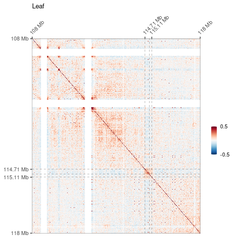<!-- -->

#### PCA

``` r
leaf_pca_roi <- 
  leaf_roi_oe_ab_compartment %>%
  rbind(data_frame(x = leaf_roi_oe_ab_compartment$y, 
                   y = leaf_roi_oe_ab_compartment$x, 
                   counts = leaf_roi_oe_ab_compartment$counts)) %>%
  mutate(counts = as.numeric(counts)) %>%
  unique() %>%
  pivot_wider(names_from = y, 
              values_from = counts) %>%
  dplyr::select(!x) %>%
  
  # Remove columns and rows that only contain NAs. 
  # First command: removes rows with equal or greater number of NAs than number of columns 
  
  filter(rowSums(is.na(.)) < ncol(.)) %>%
  keep(~!all(is.na(.x)))  %>%

  mutate_all(~ replace(., is.na(.), 0)) %>%

  cor(method = "pearson") %>%
  #PCA  
  prcomp() %>% 
  
  #  The 'v' argument specifies that we only want to extract the eigenvector values
  
  tidy('v') %>%
  filter(PC == 1) %>% 
  mutate(column = as.numeric(column)) %>%
  mutate(value = as.numeric(value)) %>%
  
  # Add empty positions
  
  right_join(
    data_frame(column = seq(108000000, 118000000, by = 20000))
    ) %>% 
  
  # Add sign metadata
  # I will invert the sign so the heterochromatin matches the sign of the global A/B annotation
  
  mutate(value = value * -1) %>%
  
  mutate(sign = case_when(
    value < 0  ~ paste0("negative"),
    value > 0 ~ paste0("positive") )
    ) %>% 
  
  # Plot it 
  
  ggplot(
    aes(x = column,
        y = value)
  ) +
  
  geom_hline(yintercept=0, color = 'gray') +
  
  geom_col(aes(fill = sign, alpha = 0.5),
          position = 'dodge', stat = 'identity') +
  geom_line(size = 0.1) +
  scale_fill_manual(values=c("#784D80", "#4D805C"), guide=FALSE) +
  scale_x_continuous( breaks = c(108000000, 118000000), 
                      labels = c('108 Mb', '118 Mb'), 
                      expand = c(0, 0)
                      )  +
  scale_y_continuous(limits = c(-0.2, 0.2)) +
  geom_vline(xintercept = c(114711578, 114965818, 115118104),
             lty = 2,
             size = 0.1,
             color = "black") +
  theme_classic() +
  theme(legend.position = "none",
        axis.title.y = element_text(size = 10),
        axis.text.x = element_text(angle = 45, hjust = 1),
        text = element_text(family = "Helvetica", size = 10),
        ) +
  labs(x = "", y = "PC1 Eigenvector")

leaf_pca_roi
```

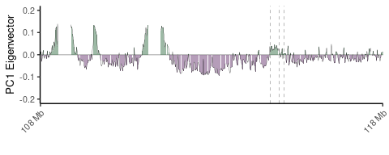<!-- -->

``` r
cor_leaf + leaf_pca_roi + 
  plot_layout(widths = unit(7, 'cm'),
              heights = unit(c(7, 2), c('cm', 'cm'))
              )
```

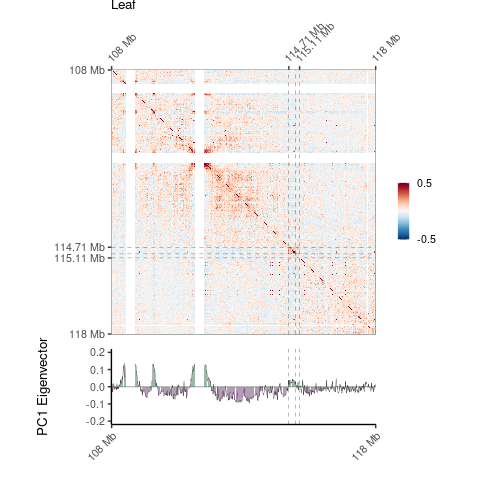<!-- -->

``` r
ggsave('figures/fig3C_leaf_cor_pca_cluster.pdf',
       width = 8,
       height = 8,
       bg = 'white')
```

### Figure 3D Root

``` r
# Observed matrix

root_roi_obs_ab_compartment <- 
  straw(norm = "KR",
      fname = "hic_input/merged_replicates/root_103M.hic",
      chr1loc = "01:108000000:118000000",
      chr2loc = "01:108000000:118000000",
      unit = "BP",
      binsize = 20000,
      matrix = "observed")

# Observed/expected matrix

root_roi_oe_ab_compartment <- 
  straw(norm = "KR",
      fname = "hic_input/merged_replicates/root_103M.hic",
      chr1loc = "01:108000000:118000000",
      chr2loc = "01:108000000:118000000",
      unit = "BP",
      binsize = 20000,
      matrix = "oe")
```

#### Supplementary Figure 7E: plot observed matrix

``` r
root_roi_obs_ab_compartment %>%
  rbind(data_frame(x = root_roi_obs_ab_compartment$y, 
                   y = root_roi_obs_ab_compartment$x, 
                   counts = root_roi_obs_ab_compartment$counts)) %>%
  unique() %>%
  ggplot(
    aes(x = y,
        y = x,
        fill = counts)
  ) +
    geom_tile(color = NA, lwd = 0) +
    scale_fill_gradientn(name = 'Norm. Counts',
                         colors = RColorBrewer::brewer.pal(9, "Reds"),
                         limits = c(0, 10),
                         breaks = c(0, 5, 10),
                         oob  = scales::oob_squish) +
  theme_classic() +
  scale_y_reverse( breaks = c(108000000, 114711578, 115118104, 118000000), 
                   labels = c('108 Mb', '114.71 Mb', '115.11 Mb', '118 Mb'),
                   expand = c(0, 0)
                   ) + 
  scale_x_continuous( breaks = c(108000000, 114711578, 115118104, 118000000), 
                      labels = c('108 Mb', '114.71 Mb', '115.11 Mb', '118 Mb'),
                      position = 'top',
                      expand = c(0, 0)
                      )  +
  theme(
        legend.key.size = unit(0.3, 'cm'), 
        legend.key.height = unit(0.3, 'cm'),
        legend.key.width = unit(0.3, 'cm'), 
        legend.title = element_text(size = 8),
        legend.text = element_text(size = 8),
        axis.line = element_blank(),
        text = element_text(family = "Helvetica", size = 10),
        axis.text.x = element_text(angle = 45, vjust = 0, hjust=0),
        panel.grid = element_blank(),
        axis.title.x = element_blank(),
        axis.title.y = element_blank(),
        plot.title = element_text(size = 10),
        panel.border = element_rect(fill = NA,
                                    linewidth = 0.2,
                                    color = "black")
        ) +
  coord_fixed() +
  ggtitle('Root')
```

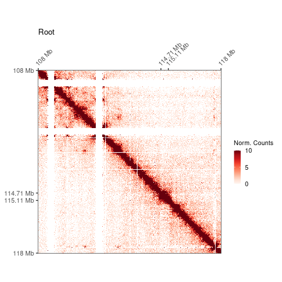<!-- -->

``` r
ggsave('figures/root_banded_area.pdf',
       dpi = 300,
       width = 4,
       height = 4,
       bg = 'white')
```

#### Figure 3D: plot Pearson’s correlation of the O/E matrix

``` r
cor_root <- 
  root_roi_oe_ab_compartment %>%
  rbind(data_frame(x = root_roi_oe_ab_compartment$y, 
                   y = root_roi_oe_ab_compartment$x, 
                   counts = root_roi_oe_ab_compartment$counts)) %>%
  mutate(counts = as.numeric(counts)) %>%
  unique() %>%
  pivot_wider(names_from = y, 
              values_from = counts) %>%
  dplyr::select(!x) %>%
  
  filter(rowSums(is.na(.)) < ncol(.)) %>%
  keep(~!all(is.na(.x)))  %>%
  
  mutate_all(~ replace(., is.na(.), 0)) %>%
  
  cor(method = "pearson") %>%
  as_tibble() %>%
  mutate(x = colnames(.)) %>%
  pivot_longer(!x, names_to = "y", values_to = "cor") %>%
  mutate_all(as.numeric) %>%
  
  ggplot(
    aes(x = x,
        y = y,
        fill = cor)
  ) +
  geom_tile() +
  scale_fill_gradientn(
                        name = "",
                        colors = rev(RColorBrewer::brewer.pal(11, "RdBu")),
                        na.value = "#F7FCFD",
                        breaks = c(-0.5, 0.5),
                        limits = c(-0.5, 0.5),
                        oob  = scales::oob_squish) +
  theme_classic() +
  scale_y_reverse( breaks = c(108000000, 114711578, 115118104, 118000000), 
                   labels = c('108 Mb', '114.71 Mb', '115.11 Mb', '118 Mb'),
                   expand = c(0, 0)
                   ) + 
  scale_x_continuous( breaks = c(108000000, 114711578, 115118104, 118000000), 
                      labels = c('108 Mb', '114.71 Mb', '115.11 Mb', '118 Mb'),
                      position = 'top',
                      expand = c(0, 0)
                      )  +
  theme(
        legend.key.size = unit(0.3, 'cm'), 
        legend.key.height = unit(0.3, 'cm'),
        legend.key.width = unit(0.3, 'cm'), 
        legend.title = element_text(size = 8),
        legend.text = element_text(size = 8),
        axis.line = element_blank(),
        text = element_text(family = "Helvetica", size = 10),
        axis.text.x = element_text(angle = 45, vjust = 0, hjust=0),
        panel.grid = element_blank(),
        axis.title.x = element_blank(),
        axis.title.y = element_blank(),
        plot.title = element_text(size = 10),
        panel.border = element_rect(fill = NA,
                                    linewidth = 0.2,
                                    color = "black")
        ) +
  coord_fixed() +
  geom_vline(xintercept = c(c(114711578, 115118104)),
             lty = 2,
             size = 0.1,
             color = "black") +
  geom_hline(yintercept = c(c(114711578, 115118104)),
             lty = 2,
             size = 0.1, 
             color = "black") +
  ggtitle('Root')

cor_root
```

<!-- --> \#### PCA

``` r
pca_roi_root <- 
  root_roi_oe_ab_compartment %>%
  
  # transform the upper diagonal matrix in ROI_shoot_obs to a full symmetric matrix in long format
  
  rbind(data_frame(x = root_roi_oe_ab_compartment$y, 
                   y = root_roi_oe_ab_compartment$x, 
                   counts = root_roi_oe_ab_compartment$counts)) %>%
  mutate(counts = as.numeric(counts)) %>%
  # some values will be repeated, keep unique
  
  unique() %>%
  
  # wide symmetric matrix necessary for pca 
  pivot_wider(names_from = y, 
              values_from = counts) %>%
  
  # remove row names 
  dplyr::select(!x) %>%
  
  # Remove columns and rows that only contain NAs. 
  # First command: removes rows with equal or greater number of NAs than number of columns 
  
  filter(rowSums(is.na(.)) < ncol(.)) %>%
  keep(~!all(is.na(.x)))  %>%
    
  # there are some loci that do not contact in our data set (NAs). prcomp() can not handle missing values
  # we will assume that those NAs means that the contacts are just 0 
  
  mutate_all(~ replace(., is.na(.), 0)) %>%
  
  #correlation
  cor(method = "pearson") %>%
  #PCA  
  prcomp() %>% 
  
  #  The 'v' argument specifies that we only want to extract the eigenvector values from the output of prcomp().
  
  tidy('v') %>%
  filter(PC == 1) %>% 
  mutate(column = as.numeric(column)) %>%
  
  # Add empty positions
  
  right_join(
    data_frame(column = seq(108000000, 118000000, by = 20000))
    ) %>% 
  
  # Add sign metadata
  mutate(value = value * -1) %>%
  mutate(sign = case_when(
    value < 0  ~ paste0("negative"),
    value > 0 ~ paste0("positive") )
    ) %>% 
  
  # Plot it 
  
  ggplot(
    aes(x = column,
        y = value)
  ) +
  
  geom_hline(yintercept=0, color = 'gray') +
  geom_col(aes(fill = sign, alpha = 0.5),
          position = 'dodge', stat = 'identity') +
  geom_line(size = 0.1) +
  scale_fill_manual(values=c("#784D80", "#4D805C"), guide=FALSE) +
  scale_x_continuous( breaks = c(108000000, 118000000), 
                      labels = c('108 Mb', '118 Mb'), 
                      expand = c(0, 0)
                      )  +
  scale_y_continuous(limits = c(-0.2, 0.2)) +
  geom_vline(xintercept = c(114711578, 115118104),
             lty = 2,
             size = 0.1,
             color = "black") +
  theme_classic() +
  theme(legend.position = "none",
        axis.title.y = element_text(size = 10),
        axis.text.x = element_text(angle = 45, hjust = 1),
        text = element_text(family = "Helvetica", size = 10),
        ) +
  labs(x = "", y = "PC1 Eigenvector")

pca_roi_root
```

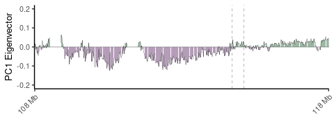<!-- -->

``` r
cor_root + pca_roi_root + 
  plot_layout(widths = unit(7, 'cm'),
              heights = unit(c(7, 2), c('cm', 'cm'))
              )
```

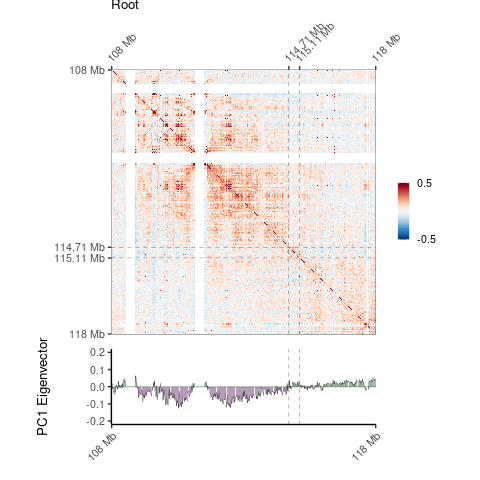<!-- -->

``` r
ggsave('figures/root_cor_pca_cluster.pdf',
       width = 7,
       height = 7,
       bg = 'white')
```

# Remove input

``` bash
rm -r hic_input
rm -r annotation
```
