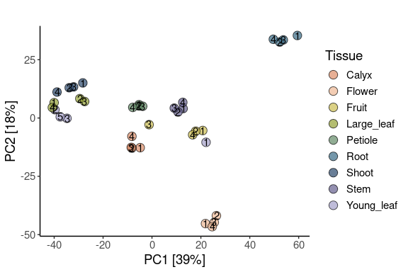
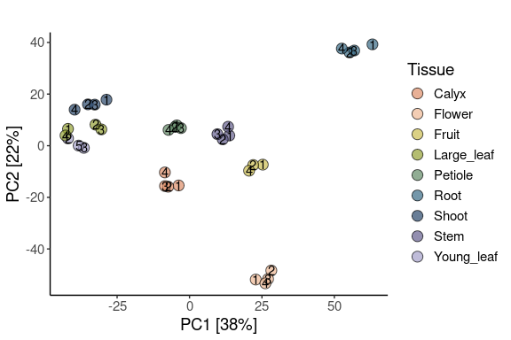
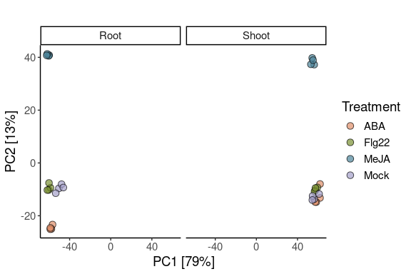
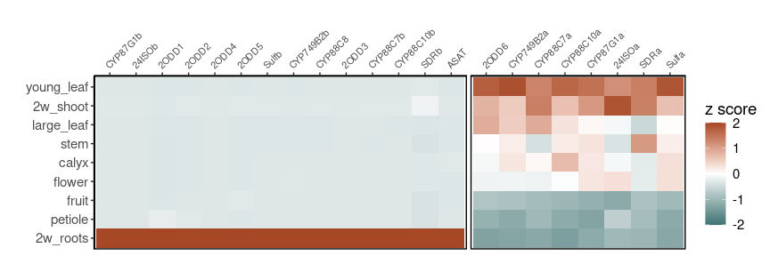
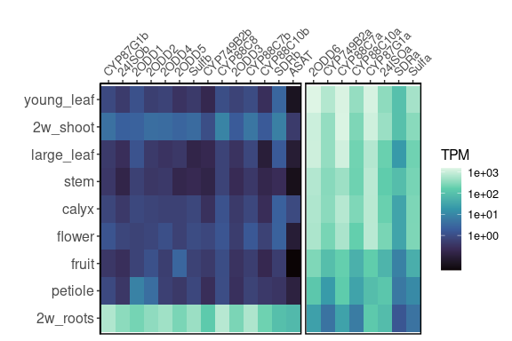
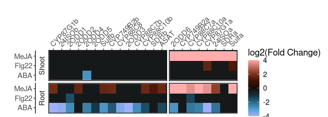
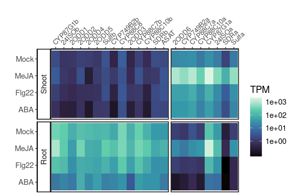
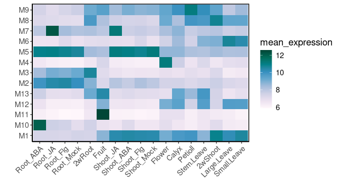

RNA-seq analysis of physalis samples
================

Download datasets

``` bash
wget --no-verbose -O rnaseq_input.tar.gz https://zenodo.org/records/13908795/files/rnaseq_input.tar.gz?download=1
tar -xzf rnaseq_input.tar.gz
rm -r rnaseq_input.tar.gz
```

    ## 2024-10-09 13:49:40 URL:https://zenodo.org/records/13908795/files/rnaseq_input.tar.gz?download=1 [10900208/10900208] -> "rnaseq_input.tar.gz" [1]

``` r
library(tidyverse)
```

    ## ── Attaching core tidyverse packages ──────────────────────── tidyverse 2.0.0 ──
    ## ✔ dplyr     1.1.4     ✔ readr     2.1.5
    ## ✔ forcats   1.0.0     ✔ stringr   1.5.1
    ## ✔ ggplot2   3.5.1     ✔ tibble    3.2.1
    ## ✔ lubridate 1.9.3     ✔ tidyr     1.3.1
    ## ✔ purrr     1.0.2     
    ## ── Conflicts ────────────────────────────────────────── tidyverse_conflicts() ──
    ## ✖ dplyr::filter() masks stats::filter()
    ## ✖ dplyr::lag()    masks stats::lag()
    ## ℹ Use the conflicted package (<http://conflicted.r-lib.org/>) to force all conflicts to become errors

``` r
sessionInfo()
```

    ## R version 4.4.1 (2024-06-14)
    ## Platform: x86_64-pc-linux-gnu
    ## Running under: Debian GNU/Linux 12 (bookworm)
    ## 
    ## Matrix products: default
    ## BLAS:   /usr/lib/x86_64-linux-gnu/atlas/libblas.so.3.10.3 
    ## LAPACK: /usr/lib/x86_64-linux-gnu/atlas/liblapack.so.3.10.3;  LAPACK version 3.11.0
    ## 
    ## locale:
    ##  [1] LC_CTYPE=C.UTF-8       LC_NUMERIC=C           LC_TIME=C.UTF-8       
    ##  [4] LC_COLLATE=C.UTF-8     LC_MONETARY=C.UTF-8    LC_MESSAGES=C.UTF-8   
    ##  [7] LC_PAPER=C.UTF-8       LC_NAME=C              LC_ADDRESS=C          
    ## [10] LC_TELEPHONE=C         LC_MEASUREMENT=C.UTF-8 LC_IDENTIFICATION=C   
    ## 
    ## time zone: Etc/UTC
    ## tzcode source: system (glibc)
    ## 
    ## attached base packages:
    ## [1] stats     graphics  grDevices utils     datasets  methods   base     
    ## 
    ## other attached packages:
    ##  [1] lubridate_1.9.3 forcats_1.0.0   stringr_1.5.1   dplyr_1.1.4    
    ##  [5] purrr_1.0.2     readr_2.1.5     tidyr_1.3.1     tibble_3.2.1   
    ##  [9] ggplot2_3.5.1   tidyverse_2.0.0
    ## 
    ## loaded via a namespace (and not attached):
    ##  [1] gtable_0.3.5      compiler_4.4.1    tidyselect_1.2.1  scales_1.3.0     
    ##  [5] yaml_2.3.10       fastmap_1.2.0     R6_2.5.1          generics_0.1.3   
    ##  [9] knitr_1.48        munsell_0.5.1     pillar_1.9.0      tzdb_0.4.0       
    ## [13] rlang_1.1.4       utf8_1.2.4        stringi_1.8.4     xfun_0.46        
    ## [17] timechange_0.3.0  cli_3.6.3         withr_3.0.1       magrittr_2.0.3   
    ## [21] digest_0.6.36     grid_4.4.1        rstudioapi_0.16.0 hms_1.1.3        
    ## [25] lifecycle_1.0.4   vctrs_0.6.5       evaluate_0.24.0   glue_1.7.0       
    ## [29] fansi_1.0.6       colorspace_2.1-1  rmarkdown_2.27    tools_4.4.1      
    ## [33] pkgconfig_2.0.3   htmltools_0.5.8.1

# Figure 1A and related suplementary figures (2A, 2B and 2E)

## Supplementary figure 2A and 2B

Outliers:

- “X9_3_S28” fruit 3
- “X4_1_S3” young leaf1

``` r
tissues_counts <- read_tsv("rnaseq_input/tissues.salmon.merged.gene_counts.tsv") %>%
  dplyr::select(!c('gene_id')) %>%
  mutate(gene_name = gsub("gene:", "", gene_name)) %>% 
  column_to_rownames("gene_name") %>%
  as.matrix() %>%
  round()

tissues_counts_no_outliers <- read_tsv("rnaseq_input/tissues.salmon.merged.gene_counts.tsv") %>%
  dplyr::select(!c('gene_id', 'X9_3_S28', 'X4_1_S3')) %>%
  mutate(gene_name = gsub("gene:", "", gene_name)) %>% 
  column_to_rownames("gene_name") %>%
  as.matrix() %>%
  round()
```

Pre-filtering low count genes

``` r
tissues_counts <- tissues_counts[rowSums(tissues_counts) > 10,]
tissues_counts_no_outliers <- tissues_counts_no_outliers[rowSums(tissues_counts_no_outliers) > 10,]
```

Metadata

``` r
tissues_metadata <- data.frame(SampleName = colnames(tissues_counts)) %>%
  separate(SampleName, c("Condition", "Replicate"), remove = F) %>%
  mutate(Condition = gsub("X10", "Calyx", Condition)) %>%
  mutate(Condition = gsub("X1", "Root", Condition)) %>%
  mutate(Condition = gsub("X2", "Shoot", Condition)) %>%
  mutate(Condition = gsub("X4", "Young_leaf", Condition)) %>%
  mutate(Condition = gsub("X5", "Large_leaf", Condition)) %>%
  mutate(Condition = gsub("X6", "Petiole", Condition)) %>%
  mutate(Condition = gsub("X7", "Stem", Condition)) %>%
  mutate(Condition = gsub("X8", "Flower", Condition)) %>%
  mutate(Condition = gsub("X9", "Fruit", Condition))  %>% 
  column_to_rownames("SampleName")
```

    ## Warning: Expected 2 pieces. Additional pieces discarded in 36 rows [1, 2, 3, 4, 5, 6, 7,
    ## 8, 9, 10, 11, 12, 13, 14, 15, 16, 17, 18, 19, 20, ...].

``` r
tissues_metadata_no_outliers <- data.frame(SampleName = colnames(tissues_counts_no_outliers)) %>%
  separate(SampleName, c("Condition", "Replicate"), remove = F) %>%
  mutate(Condition = gsub("X10", "Calyx", Condition)) %>%
  mutate(Condition = gsub("X1", "Root", Condition)) %>%
  mutate(Condition = gsub("X2", "Shoot", Condition)) %>%
  mutate(Condition = gsub("X4", "Young_leaf", Condition)) %>%
  mutate(Condition = gsub("X5", "Large_leaf", Condition)) %>%
  mutate(Condition = gsub("X6", "Petiole", Condition)) %>%
  mutate(Condition = gsub("X7", "Stem", Condition)) %>%
  mutate(Condition = gsub("X8", "Flower", Condition)) %>%
  mutate(Condition = gsub("X9", "Fruit", Condition))  %>% 
  column_to_rownames("SampleName")
```

    ## Warning: Expected 2 pieces. Additional pieces discarded in 34 rows [1, 2, 3, 4, 5, 6, 7,
    ## 8, 9, 10, 11, 12, 13, 14, 15, 16, 17, 18, 19, 20, ...].

Checking that input data for DESeq2 is correct. It is critical that the
columns of the count matrix and the rows of the column data (information
about samples) are in the same order

``` r
all(rownames(tissues_metadata) %in% colnames(tissues_counts))
```

    ## [1] TRUE

``` r
all(rownames(tissues_metadata_no_outliers) %in% colnames(tissues_counts_no_outliers))
```

    ## [1] TRUE

Input DESeqDataSet

``` r
dds_tissues_counts <- DESeq2::DESeqDataSetFromMatrix(countData = tissues_counts,
                                   colData = tissues_metadata,
                                   design = ~ Condition)
```

    ## Warning: replacing previous import 'S4Arrays::makeNindexFromArrayViewport' by
    ## 'DelayedArray::makeNindexFromArrayViewport' when loading 'SummarizedExperiment'

    ## Warning in DESeqDataSet(se, design = design, ignoreRank): some variables in
    ## design formula are characters, converting to factors

``` r
dds_tissues_counts
```

    ## class: DESeqDataSet 
    ## dim: 27203 36 
    ## metadata(1): version
    ## assays(1): counts
    ## rownames(27203): Phygri00g000010 Phygri00g000020 ... PhygriMg001080
    ##   PhygriMg001110
    ## rowData names(0):
    ## colnames(36): X10_1_S9 X10_2_S19 ... X9_3_S28 X9_4_S38
    ## colData names(2): Condition Replicate

``` r
dds_tissues_counts_no_outliers <- DESeq2::DESeqDataSetFromMatrix(countData = tissues_counts_no_outliers,
                                   colData = tissues_metadata_no_outliers,
                                   design = ~ Condition)
```

    ## Warning in DESeqDataSet(se, design = design, ignoreRank): some variables in
    ## design formula are characters, converting to factors

``` r
dds_tissues_counts_no_outliers
```

    ## class: DESeqDataSet 
    ## dim: 27197 34 
    ## metadata(1): version
    ## assays(1): counts
    ## rownames(27197): Phygri00g000010 Phygri00g000020 ... PhygriMg001080
    ##   PhygriMg001110
    ## rowData names(0):
    ## colnames(34): X10_1_S9 X10_2_S19 ... X9_2_S18 X9_4_S38
    ## colData names(2): Condition Replicate

Count normalisation

``` r
vst_tissue <- DESeq2::vst(dds_tissues_counts)
vst_tissue_no_outliers <- DESeq2::vst(dds_tissues_counts_no_outliers)
```

### Plot PCA (2A)

Tissue with outliers

``` r
DESeq2::plotPCA(vst_tissue, intgroup = c("Condition", "Replicate"), ntop = 500)
```

<!-- -->

``` r
DESeq2::plotPCA(vst_tissue, intgroup = c("Condition", "Replicate"), returnData = T, ntop = 500)  %>%
  ggplot(aes(x = PC1, y=PC2, fill = Condition, label = as.factor(Replicate))) +
  geom_point(size = 4, pch = 21, 
             alpha = 0.7
             ) +
  geom_text() +
  scale_fill_manual(values = MoMAColors::moma.colors('Rattner', n = 9, return_hex = TRUE)) +
  theme_classic() +
  theme(text=element_text(family = "Helvetica", size =14)) +
  labs(title = "",
       x = "PC1 [39%]",
       y = "PC2 [18%]",
       fill = "Tissue")
```

    ## [1] "#DE8E69" "#EEB893" "#CCBD50" "#94A134" "#628A66" "#386B85" "#29476B"
    ## [8] "#655F8E" "#A39FC9"

<!-- -->

``` r
 ggsave('figures/tissue_pca.pdf', 
        height = 4,
        width = 6,
        bg = 'white')

 ggsave('figures/tissue_pca.svg', 
        height = 4,
        width = 6,
        bg = 'white')
```

### Plot PCA (2B)

Tissue with outliers

``` r
DESeq2::plotPCA(vst_tissue_no_outliers, intgroup = c("Condition", "Replicate"), ntop = 500)
```

<!-- -->

Tissue No outliers

``` r
DESeq2::plotPCA(vst_tissue_no_outliers, intgroup = c("Condition", "Replicate"), returnData = T, ntop = 500)  %>%
  ggplot(aes(x = PC1, y=PC2, fill = Condition, label = as.factor(Replicate))) +
  geom_point(size = 4, pch = 21, 
             alpha = 0.7
             ) +
  geom_text() +
  scale_fill_manual(values = MoMAColors::moma.colors('Rattner', n = 9, return_hex = TRUE)) +
  theme_classic() +
  theme(text=element_text(family = "Helvetica", size =14)) +
  labs(title = "",
       x = "PC1 [38%]",
       y = "PC2 [22%]",
       fill = "Tissue")
```

    ## [1] "#DE8E69" "#EEB893" "#CCBD50" "#94A134" "#628A66" "#386B85" "#29476B"
    ## [8] "#655F8E" "#A39FC9"

<!-- -->

``` r
 ggsave('figures/tissue_pca_no_outliers.pdf', 
        height = 4,
        width = 6,
        bg = 'white')

 ggsave('figures/tissue_pca_no_outliers.svg', 
        height = 4,
        width = 6,
        bg = 'white')
```

## Supplementary figure 2C

``` r
elicitors_counts <- 
  read_tsv("rnaseq_input/elicitors.salmon.merged.gene_counts.tsv") %>%
  dplyr::select(!('gene_id')) %>%
  mutate(gene_name = gsub("gene:", "", gene_name)) %>% 
  column_to_rownames("gene_name") %>%
  rename_with(~ gsub("JA", "MeJA", .x, fixed = TRUE)) %>%
  as.matrix() %>%
  round()
```

Pre-filtering low count genes

``` r
elicitors_counts <- elicitors_counts[rowSums(elicitors_counts) > 10,]
```

Metadata

``` r
elicitors_metadata <- data.frame(SampleName = colnames(elicitors_counts)) %>%
  separate(SampleName, c("Tissue", "Condition", "Replicate"), remove = F) %>%
  column_to_rownames("SampleName")
```

Checking that input data for DESeq2 is correct

``` r
all(rownames(elicitors_metadata) %in% colnames(elicitors_counts))
```

    ## [1] TRUE

``` r
dds_elicitors <- DESeq2::DESeqDataSetFromMatrix(countData = elicitors_counts,
                                   colData = elicitors_metadata,
                                   design = ~ Tissue + Condition + Tissue:Condition) 
```

    ## Warning in DESeqDataSet(se, design = design, ignoreRank): some variables in
    ## design formula are characters, converting to factors

``` r
dds_elicitors
```

    ## class: DESeqDataSet 
    ## dim: 24268 32 
    ## metadata(1): version
    ## assays(1): counts
    ## rownames(24268): Phygri00g000060 Phygri00g000070 ... PhygriMg001060
    ##   PhygriMg001080
    ## rowData names(0):
    ## colnames(32): Root_ABA_1 Root_ABA_2 ... Shoot_Mock_3 Shoot_Mock_4
    ## colData names(3): Tissue Condition Replicate

Normalisation

``` r
vst_elicitors <- DESeq2::vst(dds_elicitors)
```

#### Plot PCA (2C)

``` r
DESeq2::plotPCA(vst_elicitors, intgroup = c("Tissue", "Condition"), ntop = 500)
```

<!-- -->

``` r
DESeq2::plotPCA(vst_elicitors, intgroup = c("Tissue", "Condition"), returnData = T, ntop = 500)  %>%
  ggplot(aes(x = PC1, y=PC2, fill = Condition)) +
  geom_point(size = 3, pch = 21, alpha = 0.7) +
  facet_grid(~Tissue) +
  scale_fill_manual(values = MoMAColors::moma.colors('Rattner', n = 4, return_hex = TRUE)) +
  theme_classic() +
  theme(text = element_text(family = "Helvetica", size =14) ) +
  labs(title = "",
       x = "PC1 [79%]",
       y = "PC2 [13%]",
       fill = "Treatment")
```

    ## [1] "#de8e69" "#7a9132" "#4c849a" "#a39fc9"

<!-- -->

``` r
 ggsave('figures/elicitors_pca.pdf', 
        height = 3,
        width = 5,
        bg = 'white')

 ggsave('figures/elicitors_pca.svg', 
        height = 3,
        width = 5,
        bg = 'white')
```

## Figure 1B

``` r
tissues_tpm <- read_tsv("rnaseq_input/tissues.salmon.merged.gene_tpm.tsv") %>%
  dplyr::select(!('gene_id')) %>%
  mutate(gene_name = gsub("gene:", "", gene_name))
```

Compute Z-score, remove outliers, tidy data and average tpm per tissue

``` r
outliers = c('X9_3_S28' , 'X4_1_S3')

td_tissues_tpm <- tissues_tpm %>%
  dplyr::select(!all_of(outliers)) %>%
  pivot_longer(cols = !gene_name, names_to = "Sample", values_to = "TPM") %>%
  separate(Sample, c("Tissue", "Replicate", "Run"), sep="_", extra="drop", remove=F) %>%
  dplyr::select(!c("Sample", "Run","Replicate")) %>%
  group_by(gene_name, Tissue) %>%
  summarise_all(mean) %>%
  ungroup()
```

Filter out genes with TPM \< 10 in total

``` r
expressed_genes_tissues <- td_tissues_tpm %>% 
  dplyr::select(gene_name, TPM) %>%
  group_by(gene_name) %>%
  summarise_all(sum) %>%
  filter(TPM >= 10)
```

zscore of expressed genes

``` r
z_score_expressed_genes_tissue <- td_tissues_tpm %>%
  filter(gene_name %in% expressed_genes_tissues$gene_name) %>%
  group_by(gene_name) %>% 
  mutate(z_score = (TPM - mean(TPM)) / sd(TPM)) %>%
  ungroup %>%
  dplyr::select(gene_name, Tissue, z_score)
```

Appending z score to the main dataframe

``` r
td_zs_tissues <- left_join(td_tissues_tpm, z_score_expressed_genes_tissue)
```

Renaming and reordering tissue

``` r
tissue_code <- c("X1","X2","X4","X5","X6","X7","X8","X9","X10")
tissue_name <- c("2w_roots", "2w_shoot", "young_leaf", "large_leaf","petiole","stem","flower","fruit", "calyx")

tissue_df <- data_frame(tissue_code, tissue_name) %>% 
  magrittr::set_colnames(c("Tissue","Tissue_Name"))
```

    ## Warning: `data_frame()` was deprecated in tibble 1.1.0.
    ## ℹ Please use `tibble()` instead.
    ## This warning is displayed once every 8 hours.
    ## Call `lifecycle::last_lifecycle_warnings()` to see where this warning was
    ## generated.

``` r
td_zs_tissues <- left_join(td_zs_tissues, tissue_df)

tissue_order <- c("2w_roots",
                  "petiole",
                  "fruit",
                  "flower",
                  "calyx",
                  "stem",
                  "large_leaf",
                  "2w_shoot",
                  "young_leaf")
```

Defining cluster genes

``` r
# RENAME THE GENES

cluster_genes_id = c('Phygri01g018760','Phygri01g018780','Phygri01g018790','Phygri01g018800','Phygri01g018810','Phygri01g018820','Phygri01g018840','Phygri01g018850','Phygri01g018880','Phygri01g018890','Phygri01g018900','Phygri01g018920','Phygri01g018930','Phygri01g018940','Phygri01g018950','Phygri01g018960','Phygri01g018970','Phygri01g018980','Phygri01g018990', 'Phygri01g019010','Phygri01g019020','Phygri01g019040')

cluster_genes_name = c('CYP87G1b','24ISOb', '2ODD1','2ODD2', '2ODD4', '2ODD5', 'Sulfb', 'CYP749B2b','CYP88C8', '2ODD3', 'CYP88C7b', 'CYP88C10b', 'SDRb', 'ASAT', '2ODD6', 'CYP749B2a', 'CYP88C7a', 'CYP88C10a', 'CYP87G1a', '24ISOa', 'SDRa', 'Sulfa')

cluster_genes_expression = c("R", "R","R","R","R","R","R","R","R","R","R","R","R","R","L", "L","L","L","L","L","L","L")

cluster_genes_df <- data_frame(cluster_genes_id, cluster_genes_name, cluster_genes_expression) %>% 
  magrittr::set_colnames(c("gene_name","Gene_Name", "Expression_Pattern"))
```

#### Plot

``` r
td_zs_tissues %>%
  filter(gene_name %in% cluster_genes_id) %>%
  left_join(cluster_genes_df) %>%
  ggplot(aes(y = fct_relevel(Tissue_Name, tissue_order), 
             x = fct_relevel(Gene_Name, cluster_genes_name),
             fill = z_score)) +
  facet_grid(~factor(Expression_Pattern, levels = c("R", "L")), 
             drop = T, 
             scales="free_x", 
             space="free_x") +
  scale_fill_gradient2(low = "#3F7373", 
                      mid = "white",
                      high = "#A64826",
                      midpoint = 0,
                      limits = c(-2,2),
                      oob = scales::squish,
                      name = "z score" ) +
  labs(x = "", 
       y = "") +
  scale_x_discrete(position = "top") +
  theme_classic() +
  theme(
        text = element_text(family = "Helvetica", size = 14),
        axis.text.x = element_text(size = 8, angle = 45, vjust = 0.5, hjust=0),
        strip.text.x = element_blank(),
        panel.border = element_rect(fill = NA,
                                    linewidth = 1,
                                    color = "black"),
        panel.spacing = unit(0.2, "lines")
        ) +
  geom_tile()
```

<!-- -->

``` r
ggsave('figures/Tissue_heatmap.svg',
       bg = 'white',
       width = 9,
       height = 3)

ggsave('figures/Tissue_heatmap.pdf',
       bg = 'white',
       width = 9,
       height = 3)
```

## Supplementary figure 2E

``` r
td_zs_tissues %>%
  filter(gene_name %in% cluster_genes_id) %>%
  left_join(cluster_genes_df) %>%
  ggplot(aes(y = fct_relevel(Tissue_Name, tissue_order), 
             x = fct_relevel(Gene_Name, cluster_genes_name),
             fill = TPM)) +
  facet_grid(~factor(Expression_Pattern, levels = c("R", "L")), 
             drop = T, 
             scales="free_x", 
             space="free_x") +
  scale_fill_viridis_c(option = 'mako',
                       trans = "log",
                       breaks = scales::trans_breaks("log10", function(x) 10^x)(c(1, 1e6)),
                       oob = scales::squish ) + 
                     
  labs(x = "", 
       y = "") +
  scale_x_discrete(position = "top") + 
  theme_classic() +
  theme(
        text = element_text(family = "Helvetica", size = 12),
        axis.text.x = element_text(size = 10, angle = 45, vjust = 0.5, hjust=0),
        axis.text.y = element_text(size = 12),
        strip.text.x = element_blank(),
        panel.border = element_rect(fill = NA,
                                    linewidth = 1,
                                    color = "black"),
        panel.spacing = unit(0.2, "lines")
        ) +
  geom_tile()
```

<!-- -->

``` r
ggsave('figures/Tissue_heatmap_tpm.svg',
       bg = 'white',
       width = 6,
       height = 4)

ggsave('figures/Tissue_heatmap_tpm.pdf',
       bg = 'white',
       width = 6,
       height = 4)
```

## Figure 1C

``` r
##### SHOOT ####
dds_elicitors_shoot <- DESeq2::DESeqDataSetFromMatrix(countData = elicitors_counts %>%
                                                        as.data.frame() %>%
                                                        dplyr::select(starts_with("Shoot")) %>%
                                                        as.matrix(),
                                   colData = elicitors_metadata %>%
                                     dplyr::filter(Tissue == 'Shoot') %>%
                                     dplyr::select(!Tissue),
                                   design = ~ Condition)
```

    ## Warning in DESeqDataSet(se, design = design, ignoreRank): some variables in
    ## design formula are characters, converting to factors

``` r
##### ROOT ####
dds_elicitors_root <- DESeq2::DESeqDataSetFromMatrix(countData = elicitors_counts %>%
                                                        as.data.frame() %>%
                                                        dplyr::select(starts_with("Root")) %>%
                                                        as.matrix(),
                                   colData = elicitors_metadata %>%
                                     dplyr::filter(Tissue == 'Root') %>%
                                     dplyr::select(!Tissue),
                                   design = ~ Condition)
```

    ## Warning in DESeqDataSet(se, design = design, ignoreRank): some variables in
    ## design formula are characters, converting to factors

Set reference

``` r
#### SHOOT ####
dds_elicitors_shoot$Condition <- relevel(dds_elicitors_shoot$Condition, ref = "Mock")

#### ROOT ####
dds_elicitors_root$Condition <- relevel(dds_elicitors_root$Condition, ref = "Mock")
```

Run Differentially Expression Analysis

``` r
##### SHOOT #####
dds_elicitors_shoot_DESeq <- DESeq2::DESeq(dds_elicitors_shoot)

##### ROOT #####
dds_elicitors_root_DESeq <- DESeq2::DESeq(dds_elicitors_root)
```

See groups

Shoot

``` r
DESeq2::resultsNames(dds_elicitors_shoot_DESeq)
```

    ## [1] "Intercept"               "Condition_ABA_vs_Mock"  
    ## [3] "Condition_Flg22_vs_Mock" "Condition_MeJA_vs_Mock"

Root

``` r
DESeq2::resultsNames(dds_elicitors_root_DESeq)
```

    ## [1] "Intercept"               "Condition_ABA_vs_Mock"  
    ## [3] "Condition_Flg22_vs_Mock" "Condition_MeJA_vs_Mock"

Extract results DESeq

``` r
### SHOOT ###

all_l2fcs_shoot <- rbind(
  DESeq2::results(dds_elicitors_shoot_DESeq, c("Condition", "MeJA", "Mock"), tidy = T) %>%
    mutate(Comparison = "Shoot_MeJA"),
  DESeq2::results(dds_elicitors_shoot_DESeq, c("Condition", "Flg22", "Mock"), tidy = T) %>%
    mutate(Comparison = "Shoot_Flg22"),
  DESeq2::results(dds_elicitors_shoot_DESeq, c("Condition", "ABA", "Mock"), tidy = T) %>%
    mutate(Comparison = "Shoot_ABA")
) %>%
  # Adjust to account for large number of comparisons
  mutate(padj_global = p.adjust(pvalue,"fdr") ) %>%
  mutate(gene_name = row)


### ROOT ###

all_l2fcs_root <- rbind(
  DESeq2::results(dds_elicitors_root_DESeq, c("Condition", "MeJA", "Mock"), tidy = T) %>%
    mutate(Comparison = "Root_MeJA"),
  DESeq2::results(dds_elicitors_root_DESeq, c("Condition", "Flg22", "Mock"), tidy = T) %>%
    mutate(Comparison = "Root_Flg22"),
  DESeq2::results(dds_elicitors_root_DESeq, c("Condition", "ABA", "Mock"), tidy = T) %>%
    mutate(Comparison = "Root_ABA")
) %>%
  # Adjust to account for large number of comparisons
  mutate(padj_global = p.adjust(pvalue,"fdr") ) %>%
  mutate(gene_name = row)


### Both Combined

all_l2fcs_sep <- rbind(all_l2fcs_shoot, all_l2fcs_root)
```

### Plot

``` r
all_l2fcs_sep %>%
  filter(gene_name %in% cluster_genes_id) %>%
  left_join(cluster_genes_df) %>%
  separate("Comparison", c("Tissue", "Treatment"),"_", remove=F) %>% 
  # set DEG
  mutate(DEG = case_when(
    padj_global < 0.01 & log2FoldChange >= 1 ~ paste0("UP"),
    padj_global < 0.01 & log2FoldChange <= -1 ~ paste0("DW"),
    padj_global > 0.01 ~ paste0("NoDiff"),
    log2FoldChange >= -1 & log2FoldChange <= 1 ~ paste0("NoDiff"),
    is.na(padj_global) ~ paste0("NoDiff")
                       ) ) %>%
  mutate(log2FoldChange = case_when(DEG == "NoDiff" ~ NA_real_,
                                    TRUE ~ log2FoldChange) 
         ) %>%
  ggplot(aes(y = Treatment,
             x = fct_relevel(Gene_Name, cluster_genes_name), # setting the order
             fill = log2FoldChange)) +
  facet_grid(cols = vars(factor(Expression_Pattern, levels = c("R", "L"))),
             rows = vars(factor(Tissue, levels = c("Shoot", "Root"))),
             drop = T,
             switch = "y",
             scales="free", 
             space="free") +
  scale_fill_gradientn(colors = scico::scico(9, palette = 'berlin'),
                      na.value = "#161919",
                      limits = c(-4,4),
                      oob = scales::squish,
                      name = "log2(Fold Change)" ) +
  labs(x = "", 
       y = "") +
  scale_x_discrete(position = "top") + 
  theme_classic() +
  theme(
        text = element_text(family = "Helvetica", size = 14),
        axis.text.x = element_text(angle = 45, vjust = 0.5, hjust=0),
        strip.text.x = element_blank(),
        strip.background = element_rect(colour=NA, fill=NA),
        panel.border = element_rect(fill = NA, 
                                    linewidth = 1,
                                    color = "black"),
        panel.spacing = unit(0.2, "lines"),
        ) +
  geom_tile()
```

<!-- -->

``` r
ggsave('figures/Elicitors_LFC_heatmap.pdf', 
       bg = 'white',
       width = 7,
       height = 2.5)
```

## Supplementary figure 2F

``` r
elicitors_tpm <- 
  read_tsv("rnaseq_input/elicitors.salmon.merged.gene_tpm.tsv") %>%
  rename_with(~ gsub("JA", "MeJA", .x, fixed = TRUE)) %>%
  dplyr::select(!('gene_name'))
```

Mean tpm per replicate

``` r
td_elicitors_tpm <- elicitors_tpm %>%
  mutate(gene_name = gsub("gene:", "", gene_id)) %>%
  dplyr::select(!gene_id) %>%
  pivot_longer(cols = !gene_name, names_to = "Sample", values_to = "TPM") %>%
  separate(Sample, c("Tissue", "Treatment", "Replicate"), sep="_", extra="drop", remove=F) %>%
  dplyr::select(!c("Sample", "Replicate")) %>%
  group_by(gene_name, Tissue, Treatment) %>%
  summarise_all(mean) %>%
  ungroup()
```

FILTER OUT GENES WITH TPM \< 10 IN TOTAL

``` r
expressed_genes_elicitors <- td_elicitors_tpm %>% 
  dplyr::select(!c("Tissue", "Treatment")) %>%
  group_by(gene_name) %>%
  summarise_all(sum) %>%
  filter(TPM >= 10)
```

zscore of expressed genes

``` r
z_score_expressed_genes_td_elicitors_tpm <- td_elicitors_tpm %>%
  filter(gene_name %in% expressed_genes_elicitors$gene_name) %>%
  group_by(gene_name) %>% 
  mutate(z_score = (TPM - mean(TPM)) / sd(TPM)) %>%
  ungroup %>%
  select(gene_name, Tissue, Treatment, z_score)
```

Appending z score to the main dataframe

``` r
zs_td_elicitors_tpm <- left_join(td_elicitors_tpm, z_score_expressed_genes_td_elicitors_tpm) 
```

### Plot

``` r
tissue_order_elicitors <- c("Root_ABA",
                  "Root_Flg22", 
                  "Root_MeJA",
                  "Root_Mock",
                  "Shoot_ABA",
                  "Shoot_Flg22",
                  "Shoot_MeJA",
                  "Shoot_Mock")
```

Heatmap tpm elicitors

``` r
zs_td_elicitors_tpm %>%
  filter(gene_name %in% cluster_genes_id) %>%
  left_join(cluster_genes_df) %>%
  ggplot(aes(y = Treatment,
             x = fct_relevel(Gene_Name, cluster_genes_name), 
             fill = TPM)) +
  facet_grid(cols = vars(factor(Expression_Pattern, levels = c("R", "L"))),
             rows = vars(factor(Tissue, levels = c("Shoot", "Root"))),
             drop = T,
             switch = "y",
             scales="free", 
             space="free") +
  scale_fill_viridis_c(option = 'mako',
                       trans = "log",
                       breaks = scales::trans_breaks("log10", function(x) 10^x)(c(1, 1e6)),
                       oob = scales::squish,
                       na.value = "black") +
  labs(x = "", 
       y = "") +
  scale_x_discrete(position = "top") +
  theme_classic() +
  theme(
        text = element_text(family = "Helvetica", size = 14),
        axis.text.x = element_text(size = 10, angle = 45, vjust = 0.5, hjust=0),
        strip.text.x = element_blank(),
        panel.border = element_rect(fill = NA,
                                    linewidth = 1,
                                    color = "black"),
        panel.spacing = unit(0.2, "lines")
        ) +
  geom_tile()
```

<!-- -->

``` r
ggsave('figures/elicitors_heatmap_tpm.svg',
       bg = 'white',
       width = 6,
       height = 4)
```

    ## Warning in scale_fill_viridis_c(option = "mako", trans = "log", breaks =
    ## (scales::trans_breaks("log10", : log-2.718282 transformation introduced
    ## infinite values.

``` r
ggsave('figures/elicitors_heatmap_tpm.pdf',
       bg = 'white',
       width = 6,
       height = 4)
```

    ## Warning in scale_fill_viridis_c(option = "mako", trans = "log", breaks =
    ## (scales::trans_breaks("log10", : log-2.718282 transformation introduced
    ## infinite values.

## Supplementary Figure 2D

Load Expression as Non-normalised Counts

Tissue

``` r
tissues_counts_cemitool <- read_tsv("rnaseq_input/tissues.salmon.merged.gene_counts.tsv") %>%
  dplyr::select(!('gene_id')) %>%
  mutate(Gene_Name= gsub("gene:", "", gene_name)) %>%
  select(!c("gene_name", "X9_3_S28", "X4_1_S3"))
```

Elicitors

``` r
elicitor_counts_cemitool <- read_tsv("rnaseq_input/elicitors.salmon.merged.gene_counts.tsv") %>%
  dplyr::select(!('gene_id')) %>%
  mutate(Gene_Name= gsub("gene:", "", gene_name)) %>%
  select(!gene_name)
```

Combined datasets

``` r
counts_datasets_physalis <- dplyr::left_join(tissues_counts_cemitool, 
                                    elicitor_counts_cemitool, 
                                    by = "Gene_Name",
                                    keep = TRUE) %>% 
                    mutate(Gene_Name = Gene_Name.x) %>%
                    select(!c("Gene_Name.x", "Gene_Name.y")) %>%
                    column_to_rownames("Gene_Name") %>%
                    as.matrix() %>%
                    round()
```

Normalise Counts

``` r
counts_datasets_physalis_norm <- 
  DESeq2::vst(counts_datasets_physalis, blind = TRUE) %>%
                        as.data.frame()
```

Experiment Metadata

``` r
tissue_code <- c("X1","X2","X4","X5","X6","X7","X8","X9","X10")
tissue_name <- c("2w_roots", "2w_shoot", "young_leaf", "old_leaf","petiole","stem","flower","fruit", "calyx")
```

``` r
Physalis_metadata <- data.frame(SampleName = colnames(counts_datasets_physalis_norm)) %>%
  separate(SampleName, c("Tissue", "Condition"), remove = F) %>%
  mutate(Condition = gsub("22", "", Condition)) %>%
  mutate(Condition = gsub("1|2|3|4|5", "No-Treatment", Condition)) %>%
  mutate(Tissue = gsub("X10", "Calyx", Tissue)) %>%
  mutate(Tissue = gsub("X1", "Root", Tissue)) %>%
  mutate(Tissue = gsub("X2", "Shoot", Tissue)) %>%
  mutate(Tissue = gsub("X4", "Small_Leave", Tissue)) %>%
  mutate(Tissue = gsub("X5", "Large_Leave", Tissue)) %>%
  mutate(Tissue = gsub("X6", "Petiol", Tissue)) %>%
  mutate(Tissue = gsub("X7", "Stem_Leave", Tissue)) %>%
  mutate(Tissue = gsub("X8", "Flower", Tissue)) %>%
  mutate(Tissue = gsub("X9", "Fruit", Tissue)) %>%
  unite("Class", Tissue:Condition, remove = FALSE)
```

    ## Warning: Expected 2 pieces. Additional pieces discarded in 66 rows [1, 2, 3, 4, 5, 6, 7,
    ## 8, 9, 10, 11, 12, 13, 14, 15, 16, 17, 18, 19, 20, ...].

Run cemitool Careful, CEMiTool usually crashes if DESeq2 is loaded.

``` r
set.seed(78235)

Physalis_cem <- CEMiTool::cemitool(counts_datasets_physalis_norm,
                                   annot = Physalis_metadata,
                                   network_type = "signed",
                                   filter = TRUE,
                                   filter_pval = 0.1,
                                   apply_vst = FALSE,
                                   cor_method = "pearson",
                                   )
```

    ## Warning: executing %dopar% sequentially: no parallel backend registered

    ##    Power SFT.R.sq  slope truncated.R.sq mean.k. median.k. max.k. Density
    ## 1      1  0.34900  5.520         0.4580  1690.0    1690.0   1870  0.5090
    ## 2      2  0.00133  0.128        -0.0407  1040.0    1010.0   1330  0.3140
    ## 3      3  0.01700 -0.211         0.2110   722.0     696.0   1070  0.2170
    ## 4      4  0.01780 -0.149         0.4170   537.0     514.0    904  0.1610
    ## 5      5  0.06930 -0.242         0.4880   419.0     392.0    793  0.1260
    ## 6      6  0.21900 -0.362         0.5520   339.0     307.0    710  0.1020
    ## 7      7  0.43200 -0.489         0.6660   281.0     244.0    646  0.0845
    ## 8      8  0.61100 -0.592         0.7440   238.0     198.0    594  0.0716
    ## 9      9  0.71900 -0.675         0.7760   205.0     166.0    550  0.0616
    ## 10    10  0.76700 -0.744         0.7840   179.0     142.0    514  0.0537
    ## 11    12  0.84800 -0.849         0.8380   140.0     105.0    455  0.0421
    ## 12    14  0.88500 -0.923         0.8690   113.0      77.4    411  0.0341
    ## 13    16  0.91900 -0.983         0.9010    94.0      58.8    376  0.0283
    ## 14    18  0.92900 -1.020         0.9100    79.5      45.6    347  0.0239
    ## 15    20  0.92900 -1.050         0.9100    68.3      36.2    322  0.0205
    ## 16    22  0.94100 -1.070         0.9240    59.4      28.9    301  0.0179
    ## 17    24  0.94100 -1.080         0.9240    52.3      23.5    283  0.0157
    ## 18    26  0.93200 -1.090         0.9130    46.4      19.3    266  0.0140
    ## 19    28  0.93600 -1.100         0.9180    41.5      16.0    252  0.0125
    ## 20    30  0.93400 -1.110         0.9150    37.4      13.2    239  0.0112
    ##    Centralization Heterogeneity
    ## 1          0.0523        0.0612
    ## 2          0.0864        0.1360
    ## 3          0.1030        0.2310
    ## 4          0.1100        0.3250
    ## 5          0.1120        0.4100
    ## 6          0.1120        0.4870
    ## 7          0.1100        0.5560
    ## 8          0.1070        0.6190
    ## 9          0.1040        0.6770
    ## 10         0.1010        0.7310
    ## 11         0.0946        0.8280
    ## 12         0.0895        0.9160
    ## 13         0.0848        0.9970
    ## 14         0.0804        1.0700
    ## 15         0.0764        1.1400
    ## 16         0.0727        1.2000
    ## 17         0.0693        1.2600
    ## 18         0.0661        1.3200
    ## 19         0.0632        1.3700
    ## 20         0.0605        1.4200
    ## ..connectivity..
    ## ..matrix multiplication (system BLAS)..
    ## ..normalization..
    ## ..done.
    ##  ..cutHeight not given, setting it to 0.99  ===>  99% of the (truncated) height range in dendro.
    ##  ..done.
    ##  mergeCloseModules: Merging modules whose distance is less than 0.2
    ##    Calculating new MEs...

    ## Warning in fgseaMultilevel(pathways = pathways, stats = stats, minSize =
    ## minSize, : There were 5 pathways for which P-values were not calculated
    ## properly due to unbalanced (positive and negative) gene-level statistic values.
    ## For such pathways pval, padj, NES, log2err are set to NA. You can try to
    ## increase the value of the argument nPermSimple (for example set it nPermSimple
    ## = 10000)

    ## Warning in fgseaMultilevel(pathways = pathways, stats = stats, minSize =
    ## minSize, : There were 1 pathways for which P-values were not calculated
    ## properly due to unbalanced (positive and negative) gene-level statistic values.
    ## For such pathways pval, padj, NES, log2err are set to NA. You can try to
    ## increase the value of the argument nPermSimple (for example set it nPermSimple
    ## = 10000)

    ## Warning in fgseaMultilevel(pathways = pathways, stats = stats, minSize =
    ## minSize, : There were 3 pathways for which P-values were not calculated
    ## properly due to unbalanced (positive and negative) gene-level statistic values.
    ## For such pathways pval, padj, NES, log2err are set to NA. You can try to
    ## increase the value of the argument nPermSimple (for example set it nPermSimple
    ## = 10000)

    ## Warning in fgseaMultilevel(pathways = pathways, stats = stats, minSize =
    ## minSize, : For some of the pathways the P-values were likely overestimated. For
    ## such pathways log2err is set to NA.

    ## Warning in fgseaMultilevel(pathways = pathways, stats = stats, minSize =
    ## minSize, : There were 1 pathways for which P-values were not calculated
    ## properly due to unbalanced (positive and negative) gene-level statistic values.
    ## For such pathways pval, padj, NES, log2err are set to NA. You can try to
    ## increase the value of the argument nPermSimple (for example set it nPermSimple
    ## = 10000)
    ## Warning in fgseaMultilevel(pathways = pathways, stats = stats, minSize =
    ## minSize, : There were 1 pathways for which P-values were not calculated
    ## properly due to unbalanced (positive and negative) gene-level statistic values.
    ## For such pathways pval, padj, NES, log2err are set to NA. You can try to
    ## increase the value of the argument nPermSimple (for example set it nPermSimple
    ## = 10000)

    ## Warning in fgseaMultilevel(pathways = pathways, stats = stats, minSize =
    ## minSize, : There were 4 pathways for which P-values were not calculated
    ## properly due to unbalanced (positive and negative) gene-level statistic values.
    ## For such pathways pval, padj, NES, log2err are set to NA. You can try to
    ## increase the value of the argument nPermSimple (for example set it nPermSimple
    ## = 10000)

    ## Warning in fgseaMultilevel(pathways = pathways, stats = stats, minSize =
    ## minSize, : There were 1 pathways for which P-values were not calculated
    ## properly due to unbalanced (positive and negative) gene-level statistic values.
    ## For such pathways pval, padj, NES, log2err are set to NA. You can try to
    ## increase the value of the argument nPermSimple (for example set it nPermSimple
    ## = 10000)

Modules summary

``` r
# Summarizes modules using mean or eigengene expression.

# If not indicated uses mean instead of eigengene 

mod_eigengenes <- CEMiTool::mod_summary(Physalis_cem, method = 'mean') %>%
  pivot_longer(!modules, names_to = "condition", values_to = "mean_expression") %>%
  separate(condition, c("Tissue", "Treatment"), remove = F) %>%
  mutate(Treatment = gsub("22", "", Treatment)) %>%
  mutate(Treatment = gsub("1|2|3|4|5", "NA", Treatment)) %>%
  mutate(Tissue = gsub("X10", "Calyx", Tissue)) %>%
  mutate(Tissue = gsub("X1", "2wRoot", Tissue)) %>%
  mutate(Tissue = gsub("X2", "2wShoot", Tissue)) %>%
  mutate(Tissue = gsub("X4", "Small.Leave", Tissue)) %>%
  mutate(Tissue = gsub("X5", "Large.Leave", Tissue)) %>%
  mutate(Tissue = gsub("X6", "Petioll", Tissue)) %>%
  mutate(Tissue = gsub("X7", "Stem.Leave", Tissue)) %>%
  mutate(Tissue = gsub("X8", "Flower", Tissue)) %>%
  mutate(Tissue = gsub("X9", "Fruit", Tissue)) %>%
  unite("Class", Tissue:Treatment, remove = FALSE) %>%
  mutate(Class = gsub("_NA", "", Class)) %>%
  dplyr::select(modules, Class, mean_expression) %>% 
  group_by(modules, Class) %>%
  summarise_all(mean)
```

    ## Warning: Expected 2 pieces. Additional pieces discarded in 858 rows [1, 2, 3, 4, 5, 6,
    ## 7, 8, 9, 10, 11, 12, 13, 14, 15, 16, 17, 18, 19, 20, ...].

It is possible that the modules containing the root or shoot subcluster
are named differently than in the manuscript. To find in which module,
each subcluster is:

``` r
root_subcluster <-c('Phygri01g018760','Phygri01g018780','Phygri01g018790','Phygri01g018800','Phygri01g018810','Phygri01g018820','Phygri01g018840','Phygri01g018850','Phygri01g018880','Phygri01g018890','Phygri01g018900','Phygri01g018920','Phygri01g018930','Phygri01g018940')

shoot_subcluster <- c('Phygri01g018950','Phygri01g018960','Phygri01g018970','Phygri01g018980','Phygri01g018990','Phygri01g019000','Phygri01g019010','Phygri01g019020','Phygri01g019040')
```

``` r
CEMiTool::module_genes(Physalis_cem) %>%
  filter(genes %in% shoot_subcluster)
```

    ##             genes modules
    ## 1 Phygri01g018990      M1
    ## 2 Phygri01g018970      M1
    ## 3 Phygri01g019010      M1
    ## 4 Phygri01g018950      M1
    ## 5 Phygri01g018960      M1
    ## 6 Phygri01g018980      M1
    ## 7 Phygri01g019040      M1
    ## 8 Phygri01g019020      M1

``` r
CEMiTool::module_genes(Physalis_cem) %>%
  filter(genes %in% root_subcluster)
```

    ##              genes modules
    ## 1  Phygri01g018880      M3
    ## 2  Phygri01g018900      M3
    ## 3  Phygri01g018760      M3
    ## 4  Phygri01g018780      M3
    ## 5  Phygri01g018800      M3
    ## 6  Phygri01g018840      M3
    ## 7  Phygri01g018920      M3
    ## 8  Phygri01g018850      M3
    ## 9  Phygri01g018820      M3
    ## 10 Phygri01g018810      M3
    ## 11 Phygri01g018940      M3
    ## 12 Phygri01g018790      M3
    ## 13 Phygri01g018930      M3
    ## 14 Phygri01g018890      M3

``` r
modules_clustering <- mod_eigengenes %>% pivot_wider(names_from = Class, values_from = mean_expression) %>% column_to_rownames("modules") %>% as.matrix() %>% dist() %>% hclust()

Class_clustering <- c("Root_ABA", "Root_JA", "Root_Flg", "Root_Mock", "2wRoot", "Fruit", "Shoot_JA", "Shoot_ABA", "Shoot_Flg", "Shoot_Mock", "Flower", "Calyx", "Petioll", "Stem.Leave", "2wShoot", "Large.Leave", "Small.Leave")

mod_eigengenes %>%
  ggplot(aes(x = fct_relevel(Class,
                             Class_clustering),
             y =  fct_relevel(modules,
                            modules_clustering$labels),
             fill = mean_expression)) +
  scale_fill_gradientn(colors = RColorBrewer::brewer.pal(9, "PuBuGn")) +
  theme_classic() +
  labs(x = "",
       y = "") +
  theme(
        text = element_text(family = "Helvetica", size = 14),
        axis.text.x = element_text(angle = 45, vjust = 1, hjust=1),
        panel.border = element_rect(fill = NA, 
                                    linewidth = 1,
                                    color = "black"),) +
  geom_tile()
```

<!-- -->

``` r
ggsave('figures/Modules_heatmap.pdf', bg = 'white', width = 7, height = 4)
ggsave('figures/Modules_heatmap.svg', bg = 'white', width = 7, height = 4)
```

# Remove input datasets

``` bash
rm -r rnaseq_input
```
