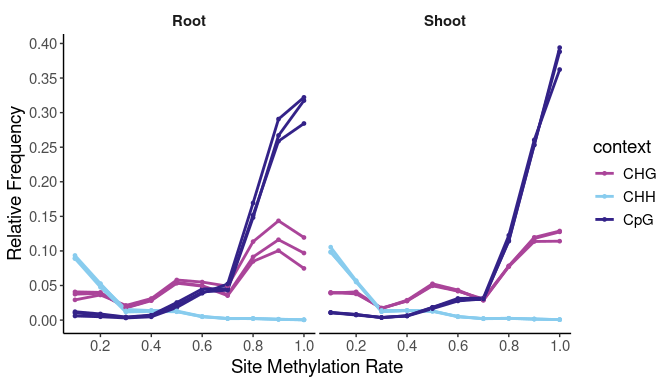
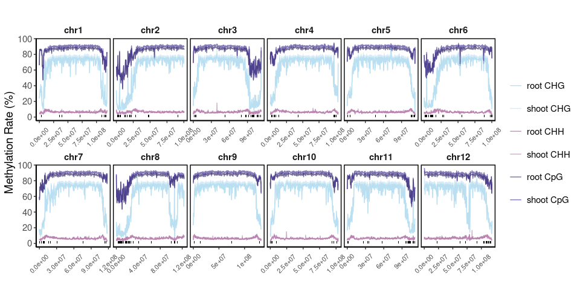
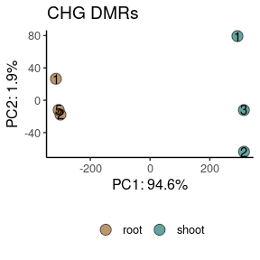
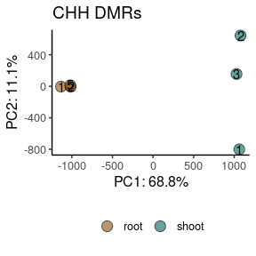
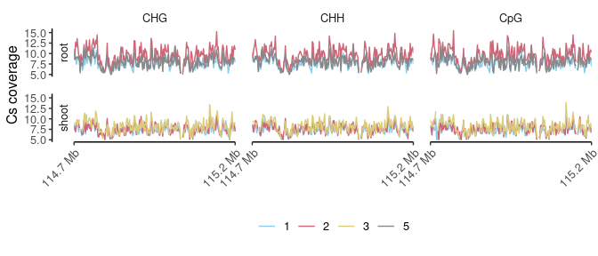
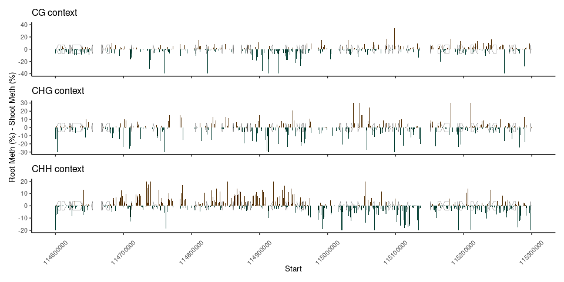

WGBS analysis
================

Download datasets

``` bash
wget --no-verbose -O wgbs_input.tar.gz https://zenodo.org/records/13908795/files/wgbs_input.tar.gz?download=1
tar -xzf wgbs_input.tar.gz
rm -r wgbs_input.tar.gz

mkdir annotation

wget --no-verbose -O annotation/Phygri1.3.2_gene_models.gff.gz https://labshare.cshl.edu/shares/schatzlab/www-data/pansol/Physalis/grisea/v1.3.2/Phygri1.3.2_gene_models.gff.gz

gunzip annotation/Phygri1.3.2_gene_models.gff.gz
```

    ## 2024-10-09 15:39:59 URL:https://zenodo.org/records/13908795/files/wgbs_input.tar.gz?download=1 [1623785353/1623785353] -> "wgbs_input.tar.gz" [1]
    ## 2024-10-09 15:41:09 URL:https://labshare.cshl.edu/shares/schatzlab/www-data/pansol/Physalis/grisea/v1.3.2/Phygri1.3.2_gene_models.gff.gz [7580565/7580565] -> "annotation/Phygri1.3.2_gene_models.gff.gz" [1]

# Sup. Fig. 9B: Relative frequency of methylation rates

``` r
relative_frequency_methylation_rates <- 
  read_table(file = 'wgbs_input/all_samples_relative_frequency_methylation_rates.tsv',
           col_names = c('frequency', 'methylation_rate', 'sample'))
```

## Plot

``` r
 relative_frequency_methylation_rates %>% 
  
  # Metadata
  separate(sample, sep = "_", into = c('file_name','extension')) %>%
  separate(file_name, into = c('sample')) %>%
  separate(extension, into = c('context')) %>%
  separate(col = sample, sep = '[1-9]', remove = FALSE, into = c('Tissue')) %>%
  separate(col = sample, sep = 't', remove = FALSE, into = c('remove', 'Replicate')) %>%
  select(-sample, -remove ) %>%

  mutate(Tissue = case_when(
    Tissue == 'shoot' ~ 'Shoot',
    Tissue == 'root' ~ 'Root'
  )) %>%
  
  # Binning
  
  mutate(bin = cut(methylation_rate, 
                   seq.int(min(methylation_rate), 
                           max(methylation_rate) + 0.1,
                       by = 0.1), 
                   right = FALSE)) %>%
  separate(bin, c("bin_min", "bin_max"), sep = ",") %>%
  mutate(bin_max = as.numeric(gsub(")", "", bin_max))) %>%
  mutate(bin_min = as.numeric(gsub("\\[", "", bin_min))) %>%
  
  # relative frequency of the observed site meth. freq
  group_by(Tissue, Replicate, context, bin_min) %>%
  summarise(bin_frequency = sum(frequency), n = n()) %>%
  mutate(bin_relative_frequency = bin_frequency/sum(bin_frequency)) %>%
  
  # PLOT 
  filter(bin_min > 0) %>%
  ggplot( aes(x = bin_min, 
              y = bin_relative_frequency,
              color = context,
              group = interaction(Replicate, context)) 
          ) +
    geom_line(
          size = 1) +
    geom_point(size = 1) +
    scale_y_continuous(breaks = scales::extended_breaks(10)) + 
    scale_x_continuous(breaks = c(0.2, 0.4, 0.6, 0.8, 1)) +
    facet_wrap(facets = vars(Tissue)) +
    xlab("Site Methylation Rate") +
    ylab("Relative Frequency") +
    theme_classic() +
    theme(
        text = element_text(family = "Helvetica", size = 14),
        strip.text.x = element_text(face = "bold"),
        strip.background = element_rect(colour = "black", 
                                        fill = "white",
                                        linewidth = 0),
        panel.spacing = unit(0.2, "lines")
        ) + 
    scale_color_manual(values = c('#AA4499', '#88CCEE', '#332288'))
```

<!-- -->

# Sup. Fig. 8

### Load Files

m = methylation percentage

``` r
m_300kb_files <- list.files(path = "wgbs_input/c_windows", 
                    pattern = ".tsv", 
                    full.names = T) %>% 
  as_tibble() %>%
  mutate(path = value) %>%
  separate(col = value, sep = "/", into = c('c1', 'c2', 'c3')) %>%
  select(path, c3) %>%
  separate(col = c3, sep = "\\.", into = c('file_name','sorted', 'extension')) %>%
  select(path, file_name, extension) %>%
  separate(col = extension, sep = '_', into = c('mark', 'context', 'smf')) %>%
  select(path, file_name, context) %>%
  separate(col = file_name, sep = '[1-9]', remove = FALSE, into = c('Tissue')) %>%
  separate(col = file_name, sep = 't', remove = FALSE, into = c('remove', 'Replicate')) %>%
  select(path, Tissue, Replicate, context) %>%
  unite(Tissue:context, col = 'file_name', sep = '_') %>%
  select(path, file_name) %>%
  mutate(file_name = paste(file_name, '_300kb_m_remove')) %>% 
  mutate(file_name = str_replace(file_name, pattern = ' ', ''))
```

``` r
for (file in 1:nrow(m_300kb_files)) {
  assign(m_300kb_files$file_name[file], 
         read_table(m_300kb_files$path[file],
                    col_names = c('Chr', 'Start', 'End', 'Avg_Meth_Perc')
                    ) %>% mutate(sample = m_300kb_files$file_name[file])
         ) 
 
}


m_300kb_data <- 
  vctrs::vec_c(root_1_CHG_300kb_m_remove, root_1_CHH_300kb_m_remove, root_1_CpG_300kb_m_remove, 
             root_2_CHG_300kb_m_remove, root_2_CHH_300kb_m_remove, root_2_CpG_300kb_m_remove, 
             root_5_CHG_300kb_m_remove, root_5_CHH_300kb_m_remove, root_5_CpG_300kb_m_remove, 
             shoot_1_CHG_300kb_m_remove, shoot_1_CHH_300kb_m_remove, shoot_1_CpG_300kb_m_remove, 
             shoot_2_CHG_300kb_m_remove, shoot_2_CHH_300kb_m_remove, shoot_2_CpG_300kb_m_remove, 
             shoot_3_CHG_300kb_m_remove, shoot_3_CHH_300kb_m_remove, shoot_3_CpG_300kb_m_remove)


remove(list = ls(pattern = "_remove"))
```

### Load gene models region

``` r
genes <- read_delim("annotation/Phygri1.3.2_gene_models.gff",
                    skip = 1,
                        col_names = c(
                                      'Chr',
                                      'annotator',
                                      'feature',
                                      'Start',
                                      'End',
                                      'V5',
                                      'Orientation',
                                      'V7',
                                      'Metadata'
                                    ))
```

### Plot

300 kb

``` r
chromosomes <- c('chr1', 'chr2', 'chr3', 'chr4', 'chr5', 'chr6', 'chr7', 'chr8', 'chr9', 'chr10', 'chr11', 'chr12' )
chr_ann <- genes %>% filter(Chr %in% chromosomes) %>% filter(feature == 'gene')

context_tissue_order <- c('root_CHG', 'shoot_CHG', 'root_CHH', 'shoot_CHH', 'root_CpG', 'shoot_CpG')

m_300kb_data %>%
  
  separate(sample, 
           into = c('tissue', 'replicate', 'context'),
           sep = '_') %>%
  group_by(tissue, context, Chr, Start, End) %>%
  summarise(Avg_Meth_Perc_Rep = mean(Avg_Meth_Perc)) %>%
  unite(tissue, context, col = 'tissue_context', sep = ' ') %>%
  filter(Chr %in% chromosomes) %>% 
  ggplot() +
  geom_line(aes( x = Start, 
               y = Avg_Meth_Perc_Rep, 
               color = tissue_context
               ),
            size = 0.5,
            alpha = 0.6
            ) + 
  scale_color_manual(values = c( '#88CCEE', '#BADDEF', '#AA4499', '#AB7BA3', '#201554', '#332288'),
                     breaks = c('root CHG', 'shoot CHG', 'root CHH', 'shoot CHH', 'root CpG', 'shoot CpG')) +
  facet_wrap(facets = vars(fct_relevel(Chr, chromosomes)),
             scales = 'free_x',
             nrow = 2) +
  scale_y_continuous(breaks = c(0, 20, 40, 60, 80, 100)) + 
  
  geom_rect(
  data = chr_ann,
    aes(
     xmin = Start,
      xmax = End,
      ymin = 0,
      ymax = 3,
    ),
    fill = "black"
  ) +
  
  theme_classic() + 
  theme(
        text = element_text(family = "Helvetica", size = 14),
        axis.text.x = element_text(size = 8, angle = 45, vjust = 0.4, hjust=0.5),
        strip.text.x = element_text(face = "bold"),
        strip.background = element_rect(colour = "black", 
                                        fill = "white",
                                        linewidth = 0),
        panel.border = element_rect(fill = NA,
                                    linewidth = 1,
                                    color = "black"),
        panel.spacing = unit(0.2, "lines"),
        legend.title = element_blank(),
        legend.key.height = unit(1, 'cm')
        ) +
  labs(title = '',
       x = '', 
       y = 'Methylation Rate (%)')
```

<!-- -->

# Sup. Fig. 9A: PCA on DMRs

## Load files

DMR Mean Methylation per Sample for PCA

``` r
dmrs_avgmeth_files <- list.files(path = "wgbs_input/05DMRs", 
                    pattern = ".tsv", 
                    full.names = T) %>% 
  as_tibble() %>%
  mutate(path = value) %>%
  separate(col = value, sep = "/", into = c('c1', 'c2', 'c3')) %>%
  select(path, c3) %>%
  separate(col = c3, sep = "\\.", into = c('file_name','sorted', 'extension')) %>%
  select(path, file_name, extension) %>%
  separate(col = extension, sep = '_', into = c('mark', 'context')) %>%
  select(path, file_name, context) %>%
  separate(col = file_name, sep = '[1-9]', remove = FALSE, into = c('Tissue')) %>%
  separate(col = file_name, sep = 't', remove = FALSE, into = c('remove', 'Replicate')) %>%
  select(path, Tissue, Replicate, context) %>%
  unite(Tissue:context, col = 'file_name', sep = '_') %>%
  select(path, file_name) %>%
  mutate(file_name = paste(file_name, '_DMRs')) %>% 
  mutate(file_name = str_replace(file_name, pattern = ' ', ''))
  

for (file in 1:nrow(dmrs_avgmeth_files)) {
  assign(dmrs_avgmeth_files$file_name[file], 
         read_delim(dmrs_avgmeth_files$path[file],
                    col_names = c('Chr', 'Start', 'End', 'Avg_Meth_Perc')
                    ) %>%
           mutate(sample_name = dmrs_avgmeth_files$file_name[file])
         ) 
 
}


dmrs_avgmeth <- rbind(
  root_1_CHG_DMRs, root_2_CHG_DMRs, root_5_CHG_DMRs, shoot_1_CHG_DMRs, shoot_2_CHG_DMRs, shoot_3_CHG_DMRs,
  root_1_CHH_DMRs, root_2_CHH_DMRs, root_5_CHH_DMRs, shoot_1_CHH_DMRs, shoot_2_CHH_DMRs, shoot_3_CHH_DMRs,
  root_1_CpG_DMRs, root_2_CpG_DMRs, root_5_CpG_DMRs, shoot_1_CpG_DMRs, shoot_2_CpG_DMRs, shoot_3_CpG_DMRs)


remove(list = ls(pattern = "DMRs"))
```

## PCA

### CHG

``` r
PCA_CHG <- 
  dmrs_avgmeth %>%
  separate(sample_name, into = c('Tissue', 'Replicate', 'Context')) %>%
  filter(Context == 'CHG') %>%
  unite(Tissue:Context, sep = '_', col = 'sample_name') %>%
  unite(Chr:End, sep = '_', col = 'DMR') %>% 
  unique() %>%
  mutate(Avg_Meth_Perc = as.numeric(Avg_Meth_Perc)) %>%
  pivot_wider(names_from = DMR,
              values_from = Avg_Meth_Perc ) %>%
  select_if(~ !any(is.na(.))) %>% # omit DMRs absent in at least 1 sample
  column_to_rownames('sample_name') %>%
  prcomp()
```

``` r
PCA_CHG_var_explained <- PCA_CHG$sdev^2/sum(PCA_CHG$sdev^2)
PCA_CHG_var_explained[1:5]
```

    ## [1] 0.945905073 0.019495747 0.014566582 0.011846119 0.008186479

``` r
PCA_CHG_plot <- 
  PCA_CHG$x %>% 
  as.data.frame %>%
  rownames_to_column("sample") %>%
  separate(sample, 
           c("tissue", "replicate")) %>%
  ggplot(aes(x=PC1, 
             y=PC2, 
             label = replicate, 
             fill = tissue)) +
  geom_point(
    shape = 21,
    size = 4,
    alpha = 0.6
  ) +
  scale_fill_manual(name = 'Tissue',
                    values=c("#8c510a", "#01665e")) +
  geom_text() + 
  theme_classic() + 
  theme(
        text = element_text(family = "Helvetica", size = 12),
        panel.spacing = unit(0.2, "lines"),
        legend.title = element_blank(),
        legend.key.height = unit(1, 'cm'),
        legend.position = 'bottom'
        ) +
  labs(x = paste0("PC1: ", round(PCA_CHG_var_explained[1]*100,1),"%"),
       y = paste0("PC2: ", round(PCA_CHG_var_explained[2]*100,1),"%")) +
  ggtitle("CHG DMRs")

PCA_CHG_plot
```

<!-- -->

### CHH

``` r
PCA_CHH <- 
  dmrs_avgmeth %>%
  separate(sample_name, into = c('Tissue', 'Replicate', 'Context')) %>%
  filter(Context == 'CHH') %>%
  unite(Tissue:Context, sep = '_', col = 'sample_name') %>%
  unite(Chr:End, sep = '_', col = 'DMR') %>% 
  unique() %>%
  mutate(Avg_Meth_Perc = as.numeric(Avg_Meth_Perc)) %>%
  pivot_wider(names_from = DMR,
              values_from = Avg_Meth_Perc ) %>%
  select_if(~ !any(is.na(.))) %>% # omit DMRs absent in at least 1 sample
  column_to_rownames('sample_name') %>%
  prcomp()
```

``` r
PCA_CHH_var_explained <- PCA_CHH$sdev^2/sum(PCA_CHH$sdev^2)
PCA_CHH_var_explained[1:5]
```

    ## [1] 0.68829137 0.11093412 0.09969748 0.05955281 0.04152421

``` r
PCA_CHH_plot <-
  PCA_CHH$x %>% 
  as.data.frame %>%
  rownames_to_column("sample") %>%
  separate(sample, 
           c("tissue", "replicate")) %>%
  ggplot(aes(x=PC1, 
             y=PC2, 
             label = replicate, 
             fill = tissue)) +
  geom_point(
    shape = 21,
    size = 4,
    alpha = 0.6
  ) +
  scale_fill_manual(name = 'Tissue',
                    values=c("#8c510a", "#01665e")) +
  geom_text() +
  theme_classic() + 
  theme(
        text = element_text(family = "Helvetica", size = 12),
        panel.spacing = unit(0.2, "lines"),
        legend.title = element_blank(),
        legend.key.height = unit(1, 'cm'),
        legend.position = 'bottom'
        ) +
  labs(x = paste0("PC1: ", round(PCA_CHH_var_explained[1]*100,1),"%"),
       y = paste0("PC2: ", round(PCA_CHH_var_explained[2]*100,1),"%")) +
  ggtitle("CHH DMRs")

PCA_CHH_plot
```

<!-- --> \### CG

``` r
PCA_CG <- 
  dmrs_avgmeth %>%
  separate(sample_name, into = c('Tissue', 'Replicate', 'Context')) %>%
  filter(Context == 'CpG') %>%
  unite(Tissue:Context, sep = '_', col = 'sample_name') %>%
  unite(Chr:End, sep = '_', col = 'DMR') %>% 
  unique() %>%
  mutate(Avg_Meth_Perc = as.numeric(Avg_Meth_Perc)) %>%
  pivot_wider(names_from = DMR,
              values_from = Avg_Meth_Perc ) %>%
  select_if(~ !any(is.na(.))) %>% # omit DMRs absent in at least 1 sample
  column_to_rownames('sample_name') %>%
  prcomp()
```

``` r
PCA_CG_var_explained <- PCA_CG$sdev^2/sum(PCA_CG$sdev^2)
PCA_CG_var_explained[1:5]
```

    ## [1] 0.87896585 0.04002774 0.03530151 0.02374003 0.02196487

``` r
PCA_CG_plot <-
  PCA_CG$x %>% 
  as.data.frame %>%
  rownames_to_column("sample") %>%
  separate(sample, 
           c("tissue", "replicate")) %>%
  ggplot(aes(x=PC1, 
             y=PC2, 
             label = replicate, 
             fill = tissue)) +
  geom_point(
    shape = 21,
    size = 4,
    alpha = 0.6
  ) +
  scale_fill_manual(name = 'Tissue',
                    values=c("#8c510a", "#01665e")) +
  geom_text() + 
  theme_classic() + 
  theme(
        text = element_text(family = "Helvetica", size = 12),
        panel.spacing = unit(0.2, "lines"),
        legend.title = element_blank(),
        legend.key.height = unit(1, 'cm'),
        legend.position = 'bottom'
        ) +
  labs(x = paste0("PC1: ", round(PCA_CG_var_explained[1]*100,1),"%"),
       y = paste0("PC2: ", round(PCA_CG_var_explained[2]*100,1),"%")) +
  ggtitle("CG DMRs")

PCA_CG_plot
```

<!-- -->

``` r
(PCA_CG_plot | PCA_CHG_plot | PCA_CHH_plot) + plot_layout(guides = "collect") &
  theme(legend.position='bottom')
```

<!-- -->

# Sup. Fig. 9C: coverage

## Load files

``` r
cs_coverage_files <- list.files(path = "wgbs_input/e_coverage", 
                    pattern = ".bed", 
                    full.names = T) %>% 
  as_tibble() %>%
  mutate(path = value) %>%
  separate(col = value, sep = "/", into = c('c1', 'c2', 'c3')) %>%
  select(path, c3) %>%
  separate(col = c3, sep = "\\.", into = c('file_name','sorted', 'extension')) %>%
  select(path, file_name, extension) %>%
  separate(col = extension, sep = '_', into = c('mark', 'context')) %>%
  select(path, file_name, context) %>%
  separate(col = file_name, sep = '[1-9]', remove = FALSE, into = c('Tissue')) %>%
  separate(col = file_name, sep = 't', remove = FALSE, into = c('remove', 'Replicate')) %>%
  select(path, Tissue, Replicate, context) %>%
  unite(Tissue:context, col = 'file_name', sep = '_') %>%
  select(path, file_name) %>%
  mutate(file_name = paste(file_name, '_Cs_coverage')) %>% 
  mutate(file_name = str_replace(file_name, pattern = ' ', ''))
  

for (file in 1:nrow(cs_coverage_files)) {
  assign(cs_coverage_files$file_name[file], 
         read_delim(cs_coverage_files$path[file],
                    col_names = c('Chr', 'Start', 'End', 'Coverage')
                    ) %>%
           mutate(sample_name = dmrs_avgmeth_files$file_name[file])
         ) 
 
}


# create a dataframe with the coverage of all the samples

cov_cytosines_cluster<- rbind(
  root_1_CHG_Cs_coverage, root_2_CHG_Cs_coverage, root_5_CHG_Cs_coverage, shoot_1_CHG_Cs_coverage, shoot_2_CHG_Cs_coverage, shoot_3_CHG_Cs_coverage,
  root_1_CHH_Cs_coverage, root_2_CHH_Cs_coverage, root_5_CHH_Cs_coverage, shoot_1_CHH_Cs_coverage, shoot_2_CHH_Cs_coverage, shoot_3_CHH_Cs_coverage,
  root_1_CpG_Cs_coverage, root_2_CpG_Cs_coverage, root_5_CpG_Cs_coverage, shoot_1_CpG_Cs_coverage, shoot_2_CpG_Cs_coverage, shoot_3_CpG_Cs_coverage)

# remove from the global environment the single files

remove(list = ls(pattern = "_Cs_coverage"))
```

## Plot

``` r
  cov_cytosines_cluster %>%
  separate(sample_name, into = c('Tissue', 'Replicate', 'Context')) %>%
  ggplot( aes(x = Start, 
              y = as.numeric(Coverage),
              color = Replicate) 
          ) +
  facet_grid(cols = vars(Context),
             rows = vars(Tissue),
             drop = T,
             switch = "y",
             space="free") +
  geom_line() +
  scale_color_manual(values = rcartocolor::carto_pal(name ='Safe', n = 4)) +
  theme_classic() +
  scale_x_continuous( breaks = c(114700000, 115118000), 
                   labels = c('114.7 Mb', '115.2 Mb'),
                      expand = c(0, 0)
                      )  +
  ylab('Cs coverage') +
  theme(
        text = element_text(family = "Helvetica", size = 12),
        panel.spacing = unit(1, "lines"),
        legend.title = element_blank(),
        legend.key.height = unit(1, 'cm'),
        legend.position = 'bottom',
        axis.title.x = element_blank(),
        axis.text.x = element_text(angle = 45, vjust = 1, hjust=1),
        strip.background = element_blank()
        )
```

<!-- -->

# Figure 4A: Number of differentially methylated regions (DMRs) identified within the RESC and SESC

### CG

``` r
#CG
BCG_CG_DMRs <- 
  read_tsv('wgbs_input/05DMRs/all/DMRs.CG.bed',
         col_names = c('Chr', 'Start', 'End', 'Length', 'Cluster_string', 'Mean_methylation_rate_C1','Mean_methylation_rate_C2','Cluster_String_C1','Cluster_String_C2', 'Number_of_total_sites', 'Differentially_methylated_context', 'Highly_Differentially_methylated_context')) %>%
  filter(Chr == 'chr1') %>%
  filter(Start %in% 114709593:115117907) %>%
  filter(End %in% 114709593:115117907) %>%
    # Count how many times we have root in cluster 1 or cluster 2
  
  mutate(root_cluster_1 = str_count(Cluster_String_C1, 'root')) %>%
  mutate(root_cluster_2 = str_count(Cluster_String_C2, 'root')) %>%
  mutate(shoot_cluster_1 = str_count(Cluster_String_C1, 'shoot')) %>%
  mutate(shoot_cluster_2 = str_count(Cluster_String_C2, 'shoot')) %>%
  
  # clean mean methylation column
  
  mutate(Mean_methylation_rate_C1 = as.numeric(str_replace(Mean_methylation_rate_C1, pattern = '1:', replacement = '') )) %>%
  mutate(Mean_methylation_rate_C2 = as.numeric(str_replace(Mean_methylation_rate_C2, pattern = '2:', replacement = '') )) %>%
  
  # define in which tissue the DMR is hypermethylated
  
  mutate(tissue_hypermethylated = case_when(root_cluster_1 > root_cluster_2 & Mean_methylation_rate_C1 > Mean_methylation_rate_C2 ~ 'Root',
                                            root_cluster_1 > root_cluster_2 & Mean_methylation_rate_C1 < Mean_methylation_rate_C2 ~ 'Shoot',
                                            root_cluster_1 < root_cluster_2 & Mean_methylation_rate_C1 > Mean_methylation_rate_C2 ~ 'Shoot',
                                            root_cluster_1 < root_cluster_2 & Mean_methylation_rate_C1 < Mean_methylation_rate_C2 ~ 'Root',
                                            TRUE ~ '' )) %>%

  # Annotate the subcluster where the DMR is located

  mutate(subcluster = case_when(Start %in% 114709593:114967818 & End %in% 114709593:114967818 ~ 'RESC',
                                Start %in% 115014426:115119907 & End %in% 115014426:115119907 ~ 'SESC',
                                TRUE ~ 'Spacer')
  ) %>%
  mutate(context = 'CG')
```

### CHG

``` r
#CHG
BCG_CHG_DMRs <- 
  read_tsv('wgbs_input/05DMRs/all/DMRs.CHG.bed',
         col_names = c('Chr', 'Start', 'End', 'Length', 'Cluster_string', 'Mean_methylation_rate_C1','Mean_methylation_rate_C2','Cluster_String_C1','Cluster_String_C2', 'Number_of_total_sites', 'Differentially_methylated_context', 'Highly_Differentially_methylated_context')) %>%
  filter(Chr == 'chr1') %>%
  filter(Start %in% 114709593:115117907) %>%
  filter(End %in% 114709593:115117907) %>%
    # Count how many times we have root in cluster 1 or cluster 2
  
  mutate(root_cluster_1 = str_count(Cluster_String_C1, 'root')) %>%
  mutate(root_cluster_2 = str_count(Cluster_String_C2, 'root')) %>%
  mutate(shoot_cluster_1 = str_count(Cluster_String_C1, 'shoot')) %>%
  mutate(shoot_cluster_2 = str_count(Cluster_String_C2, 'shoot')) %>%
  
  # clean mean methylation column
  
  mutate(Mean_methylation_rate_C1 = as.numeric(str_replace(Mean_methylation_rate_C1, pattern = '1:', replacement = '') )) %>%
  mutate(Mean_methylation_rate_C2 = as.numeric(str_replace(Mean_methylation_rate_C2, pattern = '2:', replacement = '') )) %>%
  
  # define in which tissue the DMR is hypermethylated
  
  mutate(tissue_hypermethylated = case_when(root_cluster_1 > root_cluster_2 & Mean_methylation_rate_C1 > Mean_methylation_rate_C2 ~ 'Root',
                                            root_cluster_1 > root_cluster_2 & Mean_methylation_rate_C1 < Mean_methylation_rate_C2 ~ 'Shoot',
                                            root_cluster_1 < root_cluster_2 & Mean_methylation_rate_C1 > Mean_methylation_rate_C2 ~ 'Shoot',
                                            root_cluster_1 < root_cluster_2 & Mean_methylation_rate_C1 < Mean_methylation_rate_C2 ~ 'Root',
                                            TRUE ~ '' )) %>%

  # Annotate the subcluster where the DMR is located

  mutate(subcluster = case_when(Start %in% 114709593:114967818 & End %in% 114709593:114967818 ~ 'RESC',
                                Start %in% 115014426:115119907 & End %in% 115014426:115119907 ~ 'SESC',
                                TRUE ~ 'Spacer')
  ) %>%
  mutate(context = 'CHG')
```

### CHH

``` r
#CHH
BCG_CHH_DMRs <- 
  read_tsv('wgbs_input/05DMRs/all/DMRs.CHH.bed',
         col_names = c('Chr', 'Start', 'End', 'Length', 'Cluster_string', 'Mean_methylation_rate_C1','Mean_methylation_rate_C2','Cluster_String_C1','Cluster_String_C2', 'Number_of_total_sites', 'Differentially_methylated_context', 'Highly_Differentially_methylated_context')) %>%
  filter(Chr == 'chr1') %>%
  filter(Start %in% 114709593:115117907) %>%
  filter(End %in% 114709593:115117907) %>%
    # Count how many times we have root in cluster 1 or cluster 2
  
  mutate(root_cluster_1 = str_count(Cluster_String_C1, 'root')) %>%
  mutate(root_cluster_2 = str_count(Cluster_String_C2, 'root')) %>%
  mutate(shoot_cluster_1 = str_count(Cluster_String_C1, 'shoot')) %>%
  mutate(shoot_cluster_2 = str_count(Cluster_String_C2, 'shoot')) %>%
  
  # clean mean methylation column
  
  mutate(Mean_methylation_rate_C1 = as.numeric(str_replace(Mean_methylation_rate_C1, pattern = '1:', replacement = '') )) %>%
  mutate(Mean_methylation_rate_C2 = as.numeric(str_replace(Mean_methylation_rate_C2, pattern = '2:', replacement = '') )) %>%
  
  # define in which tissue the DMR is hypermethylated
  
  mutate(tissue_hypermethylated = case_when(root_cluster_1 > root_cluster_2 & Mean_methylation_rate_C1 > Mean_methylation_rate_C2 ~ 'Root',
                                            root_cluster_1 > root_cluster_2 & Mean_methylation_rate_C1 < Mean_methylation_rate_C2 ~ 'Shoot',
                                            root_cluster_1 < root_cluster_2 & Mean_methylation_rate_C1 > Mean_methylation_rate_C2 ~ 'Shoot',
                                            root_cluster_1 < root_cluster_2 & Mean_methylation_rate_C1 < Mean_methylation_rate_C2 ~ 'Root',
                                            TRUE ~ '' )) %>%

  # Annotate the subcluster where the DMR is located

  mutate(subcluster = case_when(Start %in% 114709593:114967818 & End %in% 114709593:114967818 ~ 'RESC',
                                Start %in% 115014426:115119907 & End %in% 115014426:115119907 ~ 'SESC',
                                TRUE ~ 'Spacer')
  ) %>%
  mutate(context = 'CHH')
```

### Plot

``` r
rbind(BCG_CG_DMRs, BCG_CHG_DMRs, BCG_CHH_DMRs) %>%
  filter(subcluster != 'Insulator_Region') %>%
  filter(tissue_hypermethylated %in% c('Shoot', 'Root')) %>%
  ggplot(aes(x = tissue_hypermethylated,
             fill = tissue_hypermethylated,
             color = tissue_hypermethylated)) +
  geom_bar(alpha = 0.6) +
  facet_grid(cols = vars(subcluster),
             rows = vars(context),
             switch = "y",
             space="free") +
  scale_color_manual(name = 'Tissue',
                    values = c("#8c510a", "#01665e")) +
  scale_fill_manual(name = 'Tissue',
                    values = c("#8c510a", "#01665e")) +
  scale_y_continuous(breaks = c(1, 3, 5, 7, 9)) +
  theme_classic() +
  theme(
        text = element_text(family = "Helvetica", size = 14),
        axis.text.x = element_text(size = 14, angle = 45, vjust = 0.4, hjust=0.5),
        strip.text.x = element_text(face = "bold"),
        strip.background = element_rect(colour = "black", 
                                        fill = "white",
                                        linewidth = 0),
        panel.border = element_rect(fill = NA,
                                    linewidth = 1,
                                    color = "black"),
        panel.spacing = unit(0.2, "lines"),
        legend.title = element_blank(),
        legend.key.height = unit(0.7, 'cm'),
        legend.position = ''
        ) +
  ylab('Number of DMRs' ) +
  xlab('Hypermethylated Tissue')
```

<!-- -->

# Figure 4B: Differential DNA methylation between root and shoot tissue along the BGC and its flanking regions

### Load Files

m = methylation percentage

``` r
m_100bp_files <- list.files(path = "wgbs_input/c_windows", 
                    pattern = "100bp_window.mm", 
                    full.names = T) %>% 
  as_tibble() %>%
  mutate(path = value) %>%
  separate(col = value, sep = "/", into = c('c1', 'c2', 'c3')) %>%
  select(path, c3) %>%
  separate(col = c3, sep = "\\.", into = c('file_name','sorted', 'extension')) %>%
  select(path, file_name, extension) %>%
  separate(col = extension, sep = '_', into = c('mark', 'context', 'smf')) %>%
  select(path, file_name, context) %>%
  separate(col = file_name, sep = '[1-9]', remove = FALSE, into = c('Tissue')) %>%
  separate(col = file_name, sep = 't', remove = FALSE, into = c('remove', 'Replicate')) %>%
  select(path, Tissue, Replicate, context) %>%
  unite(Tissue:context, col = 'file_name', sep = '_') %>%
  select(path, file_name) %>%
  mutate(file_name = paste(file_name, '_100bp_m')) %>% 
  mutate(file_name = str_replace(file_name, pattern = ' ', ''))
```

``` r
for (file in 1:nrow(m_100bp_files)) {
  assign(m_100bp_files$file_name[file], 
         read_table(m_100bp_files$path[file],
                    col_names = c('Chr', 'Start', 'End', 'Avg_Meth_Perc')
                    ) %>% filter(Chr == 'chr1') %>% mutate(sample = m_100bp_files$file_name[file])
         ) 
 
}
chh_100bp_all <-
vctrs::vec_c(root_1_CHH_100bp_m, root_2_CHH_100bp_m, 
                         root_5_CHH_100bp_m, shoot_1_CHH_100bp_m, 
                         shoot_2_CHH_100bp_m, shoot_3_CHH_100bp_m)

chg_100bp_all <-
vctrs::vec_c(root_1_CHG_100bp_m, root_2_CHG_100bp_m, 
                         root_5_CHG_100bp_m, shoot_1_CHG_100bp_m, 
                         shoot_2_CHG_100bp_m, shoot_3_CHG_100bp_m)

cg_100bp_all <-
vctrs::vec_c(root_1_CpG_100bp_m, root_2_CpG_100bp_m, 
                         root_5_CpG_100bp_m, shoot_1_CpG_100bp_m, 
                         shoot_2_CpG_100bp_m, shoot_3_CpG_100bp_m)


remove(list = ls(pattern = "_100bp_m"))
```

``` r
cluster_genes_annot <- genes %>%
  filter(Chr == 'chr1') %>%
  filter(feature == 'gene') %>%
  filter(Start %in% 114600000:115300000) %>% 
  filter(End %in% 114600000:115300000) %>%
  mutate(expression = case_when(
    Start %in% 114709592:114965998 & End %in% 114709593:114965998 ~ paste0('RESC'),
    Start %in% 115000000:115117907 & End %in% 115000000:115117907 ~ paste0('SESC'),
    TRUE ~ "Out_of_the_cluster"
    
  )) %>%
  mutate(Orientation = str_replace(Orientation, "\\+", 'TRUE')) %>%
  mutate(Orientation = str_replace(Orientation, "\\-", 'FALSE'))
```

## Plot

#### CHH

``` r
chh_bcg_100bp <-
 chh_100bp_all %>%
  filter(Start %in% 114600000:115300000) %>% 
  filter(End %in% 114600000:115300000) %>% 
  mutate(Avg_Meth_Perc = as.numeric(Avg_Meth_Perc) ) %>%
  separate(sample, into = c('tissue', 'replicate', 'context')) %>%
  select(!replicate, !context) %>%
  group_by(Chr, Start, End, tissue) %>%
  mutate(Meth_Perc_Avg_Rep = mean(Avg_Meth_Perc) ) %>%
  ungroup() %>%
  select(Chr, Start, End, tissue, Meth_Perc_Avg_Rep) %>%
  unique() %>%
  group_by(Chr, Start, End) %>%
  
  
  mutate(diff_meth = Meth_Perc_Avg_Rep[tissue == "root"] - Meth_Perc_Avg_Rep[tissue == "shoot"])  %>%
  select(-tissue, -Meth_Perc_Avg_Rep) %>%
  unique() %>%
  mutate(tissue = case_when(
    diff_meth >= 0 ~ paste0("root"),
    diff_meth < 0 ~ paste0("shoot"),
  )) %>%
  # Round for representation purposes
  mutate(diff_meth_round = case_when(
    diff_meth > 20 ~ 20,
    diff_meth < -20 ~ -20,
    TRUE ~ diff_meth
  )) %>%
    ggplot() +
  # GENE MODELS
  gggenes::geom_gene_arrow(
    data = cluster_genes_annot,
    aes(xmin = Start, 
        xmax = End, 
        y = 0,
        forward = Orientation),
                  arrowhead_height = unit(4, "mm"), 
                  arrowhead_width = unit(1, "mm"),
                  arrow_body_height = grid::unit(4, "mm"),
                  linetype = 'solid',
                  
                  size = 0.1,
                  alpha = 0.9
                  ) +
  geom_col(aes(x = Start, 
              y = diff_meth_round,
              fill = tissue) ) +
  scale_x_continuous(breaks = scales::pretty_breaks(n = 10)) +
  scale_y_continuous(breaks = scales::pretty_breaks(n = 5)) +
  scale_fill_manual(values=c("#543005", "#003c30", "#B6B6B6")) +
  ggtitle("CHH context") +
  ylab('Root Meth (%) - Shoot Meth (%)') +

  # AESTHETIC
  theme_classic() +
  theme(
        text = element_text(family = "Helvetica", size = 10),
        axis.text.x = element_text( angle = 45, vjust = 0.4, hjust=0.5),
        panel.spacing = unit(0.2, "lines"),
        legend.title = element_blank(),
        plot.background = element_rect(fill='transparent', color=NA),
        legend.position="none"
        ) 
chh_bcg_100bp
```

<!-- -->

``` r
ggsave('figures/chh_cluster_100bp.pdf',
       width = 7,
       dpi = 300,
       height = 2,
       bg = 'transparent')
```

#### CHG

``` r
chg_bcg_100bp <-
chg_100bp_all %>%
  filter(Start %in% 114600000:115300000) %>% 
  filter(End %in% 114600000:115300000) %>% 
  mutate(Avg_Meth_Perc = as.numeric(Avg_Meth_Perc) ) %>%
  separate(sample, into = c('tissue', 'replicate', 'context')) %>%
  select(!replicate, !context) %>%
  group_by(Chr, Start, End, tissue) %>%
  mutate(Meth_Perc_Avg_Rep = mean(Avg_Meth_Perc) ) %>%
  ungroup() %>%
  select(Chr, Start, End, tissue, Meth_Perc_Avg_Rep) %>%
  unique() %>%
  group_by(Chr, Start, End) %>%

  
  mutate(diff_meth = Meth_Perc_Avg_Rep[tissue == "root"] - Meth_Perc_Avg_Rep[tissue == "shoot"])  %>%
  select(-tissue, -Meth_Perc_Avg_Rep) %>%
  unique() %>%
  mutate(tissue = case_when(
    diff_meth >= 0 ~ paste0("root"),
    diff_meth < 0 ~ paste0("shoot"),
  )) %>%
  # Round for representation purposes
  mutate(diff_meth_round = case_when(
    diff_meth > 30 ~ 30,
    diff_meth < -30 ~ -30,
    TRUE ~ diff_meth
   )) %>%
    ggplot() +
    # GENES MODELS
  gggenes::geom_gene_arrow(
    data = cluster_genes_annot,
    aes(xmin = Start, 
        xmax = End, 
        y = 0,
        forward = Orientation),
                  arrowhead_height = unit(4, "mm"), 
                  arrowhead_width = unit(1, "mm"),
                  arrow_body_height = grid::unit(4, "mm"),
                  linetype = 'solid',
                  
                  size = 0.1,
                  alpha = 0.9
                  ) +
  geom_col(aes(x = Start, 
              y = diff_meth_round,
              fill = tissue) ) +
  scale_x_continuous(breaks = scales::pretty_breaks(n = 10)) +
  scale_y_continuous(breaks = scales::pretty_breaks(n = 5)) +
  scale_fill_manual(values=c("#543005", "#003c30", "#B6B6B6")) +
  ggtitle("CHG context") +
  ylab('Root Meth (%) - Shoot Meth (%)') +

  # AESTHETIC
  theme_classic() +
  theme(
        text = element_text(family = "Helvetica", size = 10),
        axis.text.x = element_blank(),
        panel.spacing = unit(0.2, "lines"),
        legend.title = element_blank(),
        plot.background = element_rect(fill='transparent', color=NA),
        legend.position="none"
        ) 
chg_bcg_100bp
```

<!-- -->

``` r
ggsave('figures/chg_cluster_100bp.pdf',
       width = 7,
       dpi = 300,
       height = 2,
       bg = 'transparent')
```

#### CG

``` r
cg_bcg_100bp <-
cg_100bp_all %>%
  filter(Start %in% 114600000:115300000) %>% 
  filter(End %in% 114600000:115300000) %>% 
  mutate(Avg_Meth_Perc = as.numeric(Avg_Meth_Perc) ) %>%
  separate(sample, into = c('tissue', 'replicate', 'context')) %>%
  select(!replicate, !context) %>%
  group_by(Chr, Start, End, tissue) %>%
  mutate(Meth_Perc_Avg_Rep = mean(Avg_Meth_Perc) ) %>%
  ungroup() %>%
  select(Chr, Start, End, tissue, Meth_Perc_Avg_Rep) %>%
  unique() %>%
  group_by(Chr, Start, End) %>%

  
  mutate(diff_meth = Meth_Perc_Avg_Rep[tissue == "root"] - Meth_Perc_Avg_Rep[tissue == "shoot"])  %>%
  select(-tissue, -Meth_Perc_Avg_Rep) %>%
  unique() %>%
  mutate(tissue = case_when(
    diff_meth >= 0 ~ paste0("root"),
    diff_meth < 0 ~ paste0("shoot"),
  )) %>%
  # Round bigger than 40 or smaller than -40 to 40 and -40 (for representation purposes)
  mutate(diff_meth_round = case_when(
    diff_meth > 40 ~ 40,
    diff_meth < -40 ~ -40,
    TRUE ~ diff_meth
  )) %>%
  ggplot() +
    # GENES MODELS
  gggenes::geom_gene_arrow(
    data = cluster_genes_annot,
    aes(xmin = Start, 
        xmax = End, 
        y = 0,
        forward = Orientation),
                  arrowhead_height = unit(4, "mm"), 
                  arrowhead_width = unit(1, "mm"),
                  arrow_body_height = grid::unit(4, "mm"),
                  linetype = 'solid',
                  
                  size = 0.1,
                  alpha = 0.9
                  ) +
  geom_col(aes(x = Start, 
              y = diff_meth_round,
              fill = tissue) ) +
  scale_x_continuous(breaks = scales::pretty_breaks(n = 10)) +
  scale_y_continuous(breaks = scales::pretty_breaks(n = 5)) +
  scale_fill_manual(values=c("#543005", "#003c30", "#B6B6B6")) +
  ggtitle("CG context") +
  ylab('Root Meth (%) - Shoot Meth (%)') +

  # AESTHETIC
  theme_classic() +
  theme(
        text = element_text(family = "Helvetica", size = 10),
        axis.text.x = element_blank(),
        panel.spacing = unit(0.2, "lines"),
        legend.title = element_blank(),
        plot.background = element_rect(fill='transparent', color=NA),
        legend.position="none"
        ) 
cg_bcg_100bp
```

<!-- -->

``` r
ggsave('figures/cg_cluster_100bp.pdf',
       width = 7,
       dpi = 300,
       height = 2,
       bg = 'transparent')
```

``` r
cg_bcg_100bp / chg_bcg_100bp / chh_bcg_100bp + 
  plot_layout(
    guides = "collect",
    axis_titles = "collect"
  ) & theme(legend.position = "none")
```

<!-- -->

``` r
ggsave('figures/all_cluster_100bp.pdf',
       width = 10,
       dpi = 300,
       height = 5,
       bg = 'transparent')
```

# remove downloaded datasets

``` bash
rm -r annotation
rm -r wgbs_input
```
